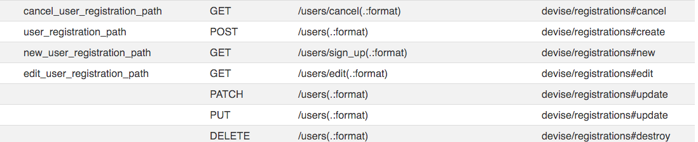
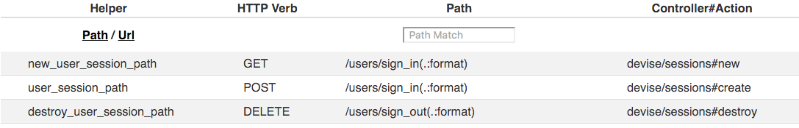

## Objectives


* Install the Devise gem.
* Generate a User model.
* Register Users.
* Authenticate/Login Users.

## Previous Lesson

[Nested Resources - Movie reviews.](NestedResources.md)

## Source Code/Implementation

**Note: The implementation of this lesson is in the `devise` branch of this repository**
[`movies_crud_app`](https://github.com/tdyer/movies_crud_app)

## Setup

Reset the DB. 

```bash
$ rake db:drop
$ rake db:create
$ rake db:migrate
$ rake db:seed
```

OR 

```bash
$ rake db:reset
...
``` 

## Devise Gem. 

The [Devise Ruby Gem](https://github.com/plataformatec/devise) is a very popular gem that is used to add User **Registration/Signup** and **Authentication/Login/Signin** to a a Rails application. 

In fact, you can see just how popular this gem is by taking a look in the [Ruby Toolbox](https://www.ruby-toolbox.com/categories/rails_authentication)

## Devise Overview.

Devise can provide a lot of functionality. It's broken up into a number of modules that each provide specific authentication features.

Let's take a look at a couple of these modules in the [Devise documentation](http://devise.plataformatec.com.br/)

In our application we will use the modules that are installed by default.

#### Database Authentication.

The [DatabaseAuthenticable Module](http://www.rubydoc.info/github/plataformatec/devise/master/Devise/Models/DatabaseAuthenticatable) provides the basic authentication behavior. It allows a user the ability to login using an email and a password.

Devise, and most other Rails authentication solutions will use a **User** model and a **users** table in the DB to implement authentication.

The **users** table will have a column for an email or username that will **uniquely** identify an application user. It will also have a column that will store the user's **encrypted** password.

**Never, ever, ever store an unecrypted, clear text, password in the DB**.

We will never store a clear text password in the DB. This is a **very large security hole**. If a malicious user does gain access to your application's DB they could access and severly misuse your online identity with this password.

During password creation or password update we will a use a [cryptographic one-way hash function](Cryptographic hash function) along with a  [salt](https://en.wikipedia.org/wiki/Salt_(cryptography)), random data, to create an encrypted password from the clear text password entered by the user.


When we enter our clear text password during authetication the system will use this same one-way hash function and salt to encrypt the clear text password we entered and compare this to the encrypted password stored in the DB. **If they match then we have successfully authenticated.**

_We'll come back to this later, after we've looked at a bit of code._

#### Recoverable module.

Resets the user password and sends reset instructions.

#### Rememberable module.

Allows the user to remember, or save, the login credentials, (email and password), in the browser.

#### Trackable module.

Allows the application to track the login count, ip address logged in from, etc.

### Configuration.

Devise is highly configurable and has a very, very rich feature set. The details of these features are described in the [Devise Documention](http://devise.plataformatec.com.br/).


### Hand Crafted Authentication.

Often development teams will choose to implement their own authentication instead of using a complex gem like Devise. The [PragStudio Rails Tutorial](https://pragmaticstudio.com/courses/rails-ii) has an excellent section about how to implement registration and authentication. There are many other tutorials online as well.

## Install Devise.

Just add it to your Gemfile and bundle install.

```ruby
...
# Add Devise Authentication/Registration
gem 'devise'
...
```

```
$ bundle install
```

## Setup Devise

#### Generate Devise config file and locales file.

```
$ rails generate devise:install
```

This will generate two files. 

* `config/initializers/devise.rb` - Devise configuration.
* `config/locales/devise.en.yml` - To change signup/signin/signout user messages.

We'll use the defaults that are enumerated in these files.

This generator will give us a number of warnings. _Not all will apply to us at this time._

We'll also see some messages about how to setup our app for Devise. We'll just:

* Make sure we have a root path in our routes file.
* Add the ability to display flash messages to the user.

#### Root Path Route

**Add this to the routes.rb file.**

```ruby
  # Accessing the root path, /, the user 
  # will be directed to the movies index action
  root to: 'movies#index'
```

Often the root path will show a Home or Dashboard page for you're app. _We'll just show the list of Movies for our app._

#### Display Flash messages.

Rails provides us with a way to send messages to user's via it's UI using the [Rails Flash](http://guides.rubyonrails.org/action_controller_overview.html#the-flash). **Click on this link and read about the Flash.**

Add the ability to display flash messages to the user. Just add two lines to the `app/view/layouts/application.html.erb` file.

```ruby
  
  <!-- Display messages from the app -->
  <p class="notice"><%= notice %></p>
  <p class="alert"><%= alert %></p>
  
  <%= yield %>
```

#### Generate a User migration, model and DB table.

```
$ rails g devise User
$ rake db:migrate
```

Here we've created a migration and User model and `users` table.

Let's take a look at the migration. You'll see that it creates a `users` table with a set of columns. And you'll see that specific Devise modules use specific columns.

The columns were interested in right now are the `email` and `encrypted_password` columns.

Let's take a look at the schema.rb to make sure we've updated the DB Schema.


## Register Users

#### Registration routes.

Before we create or register users let's take a look at the registration routes that devise generated for us. `http://localhost:3000/rails/info/routes`



This shows us that we can send an HTTP GET to `/users/sign_up` to generate a HTML Form to enter a new user's email and password.

And that this HTML Form will send/submit a HTTP POST to `/users` with the form data, email and password, to create a new User.


* How did these routes get generated? 
	* 	They where generated by `devise_for :users` in the routes file. _This got added when we generated the User model._

#### Registration Controller/Actions

**Question.** Where are the Controllers and Actions that process these requests? The above routes indicate that there should be a controller/actions for `devise/registrations#create` and `devise/registrations#new`.

**Answer.** They are part of the Devise gem. The Devise gem implements the `Devise::RegistrationsController` and all it's actions.

#### Create/Register Users.

Finally, we can create some Users!

1. Go to `http://localhost:3000/users/sign_up` to view the form to create a user.
2. Create a user with email of `moe@foo.com` and password of 'password'.
3. Check that the user has been created in the rails console.

```
$ rails c
>
> User.first
 User Load (0.3ms)  SELECT  "users".* FROM "users"  ORDER BY "users"."id" ASC\
 LIMIT 1
=> #<User id: 1, email: "moe@foo.com", encrypted_password: "$2a$10$usbIwIpJd3DdzyZeJLvyCexFoaCIUjP.APaUM0f70sL...", reset_password_token: nil, reset_password_sent_at: nil, remember_created_at: nil, sign_in_count: 1, current_sign_in_at: "2016-04-04 02:10:08", last_sign_in_at: "2016-04-04 02:10:08", current_sign_in_ip: "::1", last_sign_in_ip: "::1", created_at: "2016-04-04 02:10:08", updated_at: "2016-04-04 02:10:08">
>
```

Also, check that `users` table using `rails dbconsole` to see what the `encrypted_password` data is.

#### Registration Views.

The Forms used to Sign Up/Sign In and Sign Out, (Register, Authenticate, Logout), are also implemented in the Devise gem.

If we want to change these views we can insert them into our `app/views` directory by running another Devise generator.

```
$ rails g devise:views
```

But, we'll use the defaults generated for now.

## Sign up/Authenticate

Now, we are going to log in to our application using the **credentials, email and password, for a registered user.**

#### Routes for Sign In and Sign out.

**Go to `http://localhost:3000/rails/info/routes`**



Here we see that we have two routes to sign in, authenticate. The first route HTTP GET `/users/sign_in` will invoke the `SessionsController#new` action and will generate a sign in form.

The second route HTTP POST `/users/sign_in` will accept the data from this sign in form and attempt to **authenticate** using a User's email and password.

_Note: This is where we one-way hash the password entered by the user and compare it to the `encrypted_password` column of the `users` table. If they match we have logged in/authenticated._

**After we successfully authentication the app will store the logged in user's primary key, `id`, in a Session.**

#### Sessions

A **Session** starts when a user has logged in. And it ends when a user logs out. For Rails, the Session is hash that allows one to store data between HTTP Requests.

Remember, that HTTP is a **stateless** protocol. Each HTTP Request stands on it's own and has no knowledge of what was done in previous HTTP Requests.

But, we can maintain **a very small state** between HTTP Requests by using **Cookies**. Cookies, or Cookie storage, act like a Ruby Hash and kept in a browser. They typically have key/values pairs that can be set by the server. The Cookie store holds another Hash like data structure called the **Session**. And this Session info is passed between the Browser and Server on every HTTP Request.

In the case for authentication we use the Session to remember the **id** of the user that is currently logged in. The Session has an entry that records the  **id** of the user currently logged in. 

**The presence of a user's id in the Session indicates that that user is logged in.**

#### Login/Logout links.

Let's add links for logging in and logging out to the top of every page. Yes, this code must be in the application layout file, `app/views/layouts/application.html.erb`.


```html
 <!-- Show logged in user and links to register, authenticate and log out -->
  <% if user_signed_in? %>
    <p>User <%= current_user.email %> is signed in </p>
    <%= link_to "Sign Out", destroy_user_session_path, method: :delete %>
  <% else %>
    <p>No User is signed in </p>
    <%= link_to "Sign In", new_user_session_path %>
    <%= link_to "Sign Up", new_user_registration_path %>
  <% end %>
```

#### Access for Signed In Users

At this time any user can access any action in the application. In fact, even users that are NOT logged in can access any behavior. This is typically not a good idea.

Let's limit access based on whether a user is currently logged in.


**Add this to the movies controller.**

```ruby
class MoviesController < ApplicationController

  # Restrict access. Only signed in users can access the new/create,                                                   
  # edit, create and delete actions.                                                                                   
  before_action :authenticate_user!, except: [:index]

```

We use a method provided to us by Devise, `authenticate_user!` to determine if a user is currently logged in. 

And we use a before_action method to restrict access based on a user being authenticated.

The Use Case is:

**Non-logged in user may only view the list of movies.**

Now we should NOT be allowed to show, create, update or delete movies unless we are logged in.

The Use Case is:

**Non-logged in user may not access movie reviews.**

**Add this to the reviews controller**

```ruby
 # Restrict access. Only signed in users can access actions                                                           
  before_action :authenticate_user!, except: [:index]

```

> Check this in the UI.


#### Deny Access by Default.

Another way to control access is to deny access to all controller actions and to selectively allow access on an individual action basis.

** Remove the before_action from the MoviesController and the ReviewsController.**

**Add a before filter to the ApplicationController.**

```ruby
 # Prevent access to any action is any controller that is a subclass.
  before_action :authenticate_user!
```

This will prevent access unless we have a current user logged in.

But, we do want to allow non-logged in users to see a list of all the movies.

**In the `app/controllers/movies_controller.rb`

```
  # Allow access for the list of movies.
  skip_before_filter :authenticate_user!, only: [:index]
```

Here we skip the global restriction for non-logged in users and allow them to see all of the movies.

#### Remove links that are not allowed.

Let's not show links for Movie actions to a guest, un-logged in, user. _They can access them so let's hide them._

**In `/app/views/movies/index.html.erb`.**

```ruby
<!-- Only show links if we have a current, logged in, user -->
<% if current_user %>
    | <%= link_to("Show", movie_path(movie.id)) %>
    | <%= link_to "Edit", edit_movie_path(movie.id) %>
    | <%= link_to 'Destroy', movie_path(movie.id), method: :delete, data: { confirm: 'Are you sure?' } %>
<% end %>

```

## Resources
* [Devise Tutorial Video - Part 1](https://www.youtube.com/watch?v=qY5HccvIuS4)
* [Devise Tutorial Video - Part 2](https://www.youtube.com/watch?v=3zvyeEYXT78&list=PL5Dq9xKbrI3B29cHi2C4iBSjPldFnE0Pi&index=5)
* [Railscast Devise Tutorial](http://railscasts.com/episodes/209-devise-revised)
* [Rails Authentication from Scratch](http://railscasts.com/episodes/250-authentication-from-scratch-revised)
* [Rails Devise - gorails.com](https://gorails.com/episodes/user-authentication-with-devise)
* [Cookies](https://www.nczonline.net/blog/2009/05/05/http-cookies-explained/)
* [Cookies, Sessions and the Flash](http://www.theodinproject.com/ruby-on-rails/sessions-cookies-and-authentication)
* [PragStudio Tutorial](https://pragmaticstudio.com/courses/rails-ii)
* [Authentication From Scratch](http://railscasts.com/episodes/250-authentication-from-scratch)
* [Rails Documentation](http://api.rubyonrails.org/)
* [Debugging Rails with the byebug Gem](http://guides.rubyonrails.org/debugging_rails_applications.html#debugging-with-the-byebug-gem)
