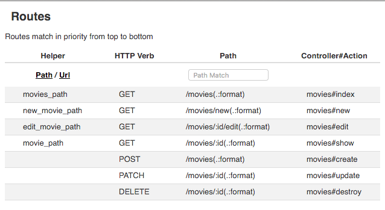

## Objectives

* Generate URL path and URL Helpers.
* Show current routes.
* Using View Helpers.
* Delete a movie.
* Using the Flash for messages.

## Previous Lesson
[Update a Movie](./ControllerUpdate.md)

## Source Code/Implementation

**Note: The implementation of this lesson is in the `movies_delete` branch of this repository**
[`movies_crud_app`](https://github.com/tdyer/movies_crud_app)

## Setup

**Re-init the DB with the schema, seed data and start the app.**

```bash
$ rake db:reset
$ rails s
```

## Route URL Helpers

**Add a path helper for two routes in the `config/routes.rb` file.**

A route not ONLY determines what controller/action should be invoked by a path and HTTP verb. It also generates path and url helpers.

The path and url helper methods are just ruby methods that generate a URL. The are often used as arguments to the `render` method or to the `link_to` helper method.

For example the **show** route:

```ruby
get '/movies/:id', to: 'movies#show', as: 'movie'
```

Will generate a movie_path method that can be used to **show** a movie, `movie_path(@movie)` and return `/movies/3`. 


The **edit** route:

```ruby
get '/movies/:id/edit, to: 'movies#edit', as: 'edit_movie'
```

Will generate a `edit_movie_path` method used to **edit** and existing movie, `edit_movie_path(@movie)` and return `/movies/3/edit`.

The **new** route:

```ruby
   get '/movies/new, to: 'movies#new', as: 'new_movie'
```

Will generate a `new_movie_path` method used create a **new** movie, `new_movie_path` and return `/movies/new`.


**Update two routes to have generate URL helpers.**

```ruby
get '/movies/new', to: 'movies#new', as: 'new_movie'
 
get '/movies/:id/edit', to: 'movies#edit', as: 'edit_movie'
```
The `:as` options will generate the correct URL paths.

Now we can see these helpers in the rails console.

```
$ rails console
> app.movies_path  
"/movies"
> 
> app.movies_path(3)
"/movies/3"
>
> app.new_movies_path
"/movies/new"
>
>> app.edit_movie_path(3)
"/movies/3/edit"
> 
```

Now we can use these URL Helper methods in a view or controller.

For example, we use these URL Helpers in the create and update actions.

**In the movies_controller.rb.**

```ruby
...
	format.html { redirect_to movie_path(@movie), notice: 'Movie created' }
...
	format.html { redirect_to movie_path(@movie), notice: 'Successfully updated the movie' }
```

And we can use these helpers along with the `link_to` helper to create a link to movie actions in the `index.html.erb` template file.

**Update the `app/views/movies/index.html.erb`**

Now the index view will have a link to the show, edit, delete movie actions. Also it will have one link to create a new movie.

```
<ul>
  <% @movies.each do |movie| %>
  <li><%= movie.name %>
    | <%= link_to("Show", movie_path(movie.id)) %>
    | <%= link_to "Edit", edit_movie_path(movie.id) %>
    | <%= link_to 'Destroy', movie_path(movie.id), method: :delete, data: { confirm: 'Are\
 you sure?' } %>
  </li>
  <% end %>
  <hr/><br/>
  <%= link_to "Create a New Movie", new_movie_path %>
</ul>

```

In the browser take a look at the HTML generated by the these helper methods.

## Show All the Routes.

Let's take a look at the app's routes.

We can do this from the browser:

`http://localhost:3333/rails/info/routes`



OR from the command line:

```
$ rake routes
Prefix Verb  URI Pattern                Controller#Action                             
    movies GET   /movies(.:format)          movies#index                                  
 new_movie GET   /movies/new(.:format)      movies#new                                    
edit_movie GET   /movies/:id/edit(.:format) movies#edit                                   
     movie GET   /movies/:id(.:format)      movies#show                                   
           POST  /movies(.:format)          movies#create                                 
           PATCH /movies/:id(.:format)      movies#update 
```

This is an often used command to see the routes for our app.


## Delete a Movie

**Add this to the routes**

```ruby
  # Route a HTTP DELETE Request for movies to the                                         
  # MoviesController destroy action.                                                      
  delete '/movies/:id', to: 'movies#destroy'
```

**Add this to the movies controller**

```ruby
# DELETE /movies/:id                                                                    
  def destroy
    @movie = Movie.find(params[:id])

    @movie.destroy
    respond_to do |format|
      format.html { redirect_to movies_url, notice: "You deleted a Movie"}
      format.json { head :no_content }
    end
  end
```

Here we simply find the movie by id and destroy it.

Take a look at the documentation for the [ActiveRecord#destroy](http://api.rubyonrails.org/classes/ActiveRecord/Relation.html#method-i-destroy) method.


## Next Lesson
[Error Handling](ControllerErrors.md)

## Resources
* [Rails Cheat Sheet](Cheatsheet.md)
* [URL Helpers](https://reinteractive.net/posts/188-rails-discovery-magical-routes-part-1-major-usages)
* [PragStudio - RubyOnRails Level 1](https://pragmaticstudio.com/rails). This is a **very** good resource for learning Rails. They have been teaching Rails since the beginning and their teaching and presentation skill are **excellent**.


