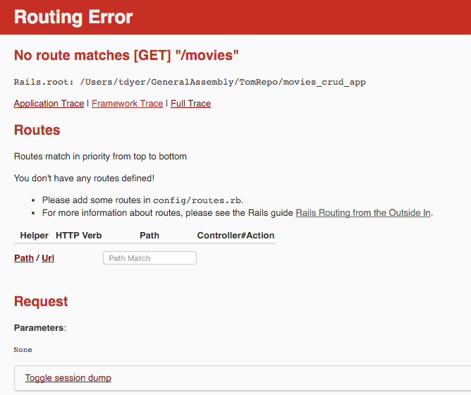
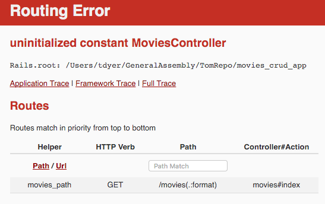
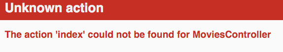

## Objectives

* Create a route to view all movies.
* Create a ActionController for the movie resource.
* Create a ActionController index action/method.
* View the HTML Representation using a View. 
* Construct a View for the HTML Represenation of all the movies.
* Update the Rails Layout.

## Model, View, Controller (MVC)

Rails is based on the MVC Architecture.


## Previous Lesson
[Create Migration and Model](CreateMigrationModel.md)

## Source Code/Implementation

**Note: The implementation of this lesson is in the `movies_index` branch of this repository**
[`movies_crud_app`](https://github.com/tdyer/movies_crud_app)

## View all the Movies.

**Start up the application and view all the movies**.

```bash
$ cd movies_crud_app
$ rake db:drop
$ rake db:create
$ rake db:migrate
$ rails db:seed
$ rails s
```

**View all movies in your browser, `http://localhost:3000/movies`**.

Oops, Rails does NOT know how to handle a HTTP `GET` Request with a path of `/movies`. We need a `route` to handle this request.




## Create a Route for viewing all Movies.

**Open the `config/routes.rb` file and add this.**

```ruby
  # Route a HTTP GET Request for all movies to the                                                                                               
  # MoviesController index action                                                                                                            
  get '/movies', to: 'movies#index'
```

This will create a route for a HTTP **GET** request to the path `/movies`. It will route the request to the **MoviesController#index** action.

**View all movies in your browser, `http://localhost:3000/movies`**.

Oops, we forgot to create a Controller for the Movie resource!



## Create A Controller for the Movie Resource

**Create a file `app/controllers/movies_controller.rb` and add this code.**

```ruby
class MoviesController < ApplicationController
end
```

**View all movies in your browser, `http://localhost:3000/movies`**.

Oops, we forgot to create a index action!



## Create a action to view movies.

**Add an index action, method, to the MoviesController.**

```ruby
  # GET /movies                                                                                                                              
  def index
    # create an instance variable, @movies, that                                                                                             
    # will have all the movies stored in the DB.                                                                                             
    @movies = Movie.all

    # generate the HTML for all the movies                                                                                                   
    movies_html = "<ul>"
    @movies.each do |movie|
      movies_html << "<li>#{movie.name}</li>"
    end
    movies_html << "</ul>"

	 # Form an HTTP Response that contains the HTML built above.
    render inline: movies_html
  end
```

Here we're getting each row out of the `movies` table and creating a movie model. @movies will be an Array of these movie models.

Then we iterating through these models and creating a HTML unordered list where each list item is the name of the movie.

* `Movie.all` - Call the `all` method on the Movie model. _This will create a movie object from each row in the `movies` table._ See [ActiveRecord#all](http://api.rubyonrails.org/classes/ActiveRecord/Scoping/Named/ClassMethods.html#method-i-all)
* `@movies` - MoviesController instance variable that will contain all the movie object/models.
* `movies_html` - Local variable that will contain the HTML for we are about to build. _Just a Ruby String containing HTML._
* `@movies.each do ... end` - Code to build one HTML `<li>` tag for each movie.
* `render inline: movies_html` - [ActionController#render](http://apidock.com/rails/ActionController/Base/render). Insert the value of movies_html, a Ruby String containing HTML, into the HTTP Response.

**Hurray, we see all the movies! But this is not the way you should do this!**

## Create a View to generate the HTML for all movies.

**Modify the `app/controllers/movies_controller.rb`**

```ruby
# GET /movies                                                                                                                              
  def index
    # create an instance variable, @movies, that                                                                                             
    # will have all the movies stored in the DB.                                                                                             
    @movies = Movie.all

    # By default will render the app/views/movies/index.html.erb file.
   end
```

**Create a ERB file for the index view in `app/views/movies/index.html.erb`**

```bash
$ mkdir app/views/movies
$ touch app/views/movies/index.html.erb
```

**Create the HTML and Ruby code to generate HTML in this view.**

```
<ul>
  <% @movies.each do |movie| %>
  <li><%= movie.name %></li>
  <% end %>
</ul>
```

Here we:

* Create a directory in `app/views` named after the resource, `movies`.
* Created a file with the same name as the action, `index`, with `.html.erb` file extension.
* Added HTML markup and Ruby code to generate HTML.

**Access `http://localhost:3000/movies`**

We should see a list of movie names that we have stored/persisted in the DB.

## Views and ERB.

The Rails convention is that we name a view after the controller action that recieves the HTTP Request. After the code has run in the controller action Rails will:

1. Locate the view in the `app/views/<resource-name>` directory. This view file will be named after the action `<action-name>.html.erb`. Ex: `app/views/movies/index.html.erb`
2. Process the contents of this file with ERB. 
3. Add the contents created in step 2 into the body of the HTTP Response.

### ERB

ERB has two frequently used operators.

`<% ruby code %>` - The less/greater than followed/preceded by the percent symbol. Anything between these is executed as Ruby code.

`<%= ruby code that produce a string %>` - Same as above except the `=` sign indicates that the ruby code will produce a string that will be inserted in the output. Another words, the string produced by the this code will become part of the body of the HTTP Response.

ERB is a templating langauge. It is one among very many templating languages. And templating langauges are typically used to produce HTML in a web application.

Almost all web frameworks have one of more templating languages they can use. And templating langauges such as **handlebars** are commonly used by javascript on the server and in the client.

Other popular templating langauges for Rails are:

* [HAML](http://haml.info/)
* [Slim](http://slim-lang.com/)


ERB is the default templating language used with Rails. But, it's no big deal at all to use HAML, Slim or some other templating language.

## HTTP Request Processing.


## Lab

* Create a Route, Controller, Controller Action and View to display all your songs.

## Rails Layouts

Let's take a look at the HTML that is sent to the browser when we access `http://localhost:3000/movies`. _View source in the browser._

```HTML
<!DOCTYPE html>
<html>
<head>
  <title>MoviesCrudApp</title>
  <link rel="stylesheet" media="all" href="/assets/application.self-e80e8f2318043e8af94dddc2adad5a4f09739a8ebb323b3ab31cd71d45fd9113.css?body=1" data-turbolinks-track="true" />
  <script src="/assets/jquery.self-660adc51e0224b731d29f575a6f1ec167ba08ad06ed5deca4f1e8654c135bf4c.js?body=1" data-turbolinks-track="true"></script>
<script src="/assets/jquery_ujs.self-e87806d0cf4489aeb1bb7288016024e8de67fd18db693fe026fe3907581e53cd.js?body=1" data-turbolinks-track="true"></script>
<script src="/assets/turbolinks.self-c37727e9bd6b2735da5c311aa83fead54ed0be6cc8bd9a65309e9c5abe2cbfff.js?body=1" data-turbolinks-track="true"></script>
<script src="/assets/application.self-3b8dabdc891efe46b9a144b400ad69e37d7e5876bdc39dee783419a69d7ca819.js?body=1" data-turbolinks-track="true"></script>
  <meta name="csrf-param" content="authenticity_token" />
<meta name="csrf-token" content="2RXHE9GpGoQeYaCWQyyj8SGQBpYTGBqe6Imvw3Z6SSfWYwJ0u19UHfoeWF9ACBOao3pZoerNBonNuLJ3Ib/tBw==" />
</head>
<body>

<ul>
  <li>Affliction</li>
  <li>Mad Max</li>
  <li>Rushmore</li>
</ul>


</body>
</html>
```

We can see our unordered list of movies that we created in our view above. **But, it's surrounded by HTML we did NOT create?**

It turns out that our views are inserted in a **layout** that provides the context, surrounding HTML.

This layout is also generated by ERB and the file that generates this layout resides in `app/views/layout/application.html.erb`. 

Let's take a look at this file.

```html
<!DOCTYPE html>
<html>
<head>
  <title>MoviesCrudApp</title>
  <%= stylesheet_link_tag    'application', media: 'all', 'data-turbolinks-track' => true %>
  <%= javascript_include_tag 'application', 'data-turbolinks-track' => true %>
  <%= csrf_meta_tags %>
</head>
<body>

<%= yield %>

</body>
</html>
``` 

This layout file will generate HTML, CSS and JS that will surround all the output generated by our views.

It will use **View Helpers** to generate CSS, JS and HTML. View Helpers are just Ruby methods that return CSS, JS and HTML.

#### View Helpers

* [`stylesheet_link_tag`](http://apidock.com/rails/ActionView/Helpers/AssetTagHelper/stylesheet_link_tag) - Will generate `HTML link tags` to include CSS in this page.
* [`javascript_include_tag`](http://apidock.com/rails/ActionView/Helpers/AssetTagHelper/javascript_include_tag) - Will generate `HTML script tags`, to include JS, javascript, in this page.
* [`csrf_meta_tags`](http://api.rubyonrails.org/classes/ActionView/Helpers/CsrfHelper.html#method-i-csrf_meta_tags) - Will generate `HTML meta tags` that will prevent specific attacks and improve security.

#### `yield`, inserting View output.

Notice that there is a `<%= yield %>` statement in the layout. This is where the output of the view will be inserted into the output.

The `<%= yield %>` will be **replaced** by the content we generate in our View. This is where the list of movies will be inserted.

**Layouts are used to remove duplicate code that is used throughout our app**

We wouldn't want to add all the HTML boilerplate code such as the html and body tags in each and every view.

That wouldn't be very [DRY](https://en.wikipedia.org/wiki/Don%27t_repeat_yourself)

## Lab 

Create a reasonable footer for our site. Probably would have our email address, mailing address, etc.

We **DO NOT** want to have to repeat this footer in every single view. _Yep, it should be in the layout.__

## Next Lesson
[Viewing One Movie](ControllerShow.md)

## Resources

* [Cheat Sheet](Cheatsheet.md)
* [Rails Cheat Sheet](Cheatsheet.md)
* [Rails Guide - Rendering in Rails](http://guides.rubyonrails.org/layouts_and_rendering.html)
* [PragStudio - RubyOnRails Level 1](https://pragmaticstudio.com/rails). This is a **very** good resource for learning Rails. They have been teaching Rails since the beginning and their teaching and presentation skill are **excellent**.


