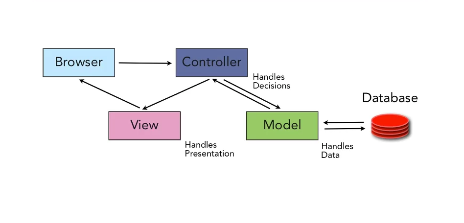

## Objectives

* Create a route to show a HTML form, used to edit a movie.
* Create a ActionController#edit action used to display this form.
* Use a View Partial for the movie form.
* Create a View to generate this form.
* Create route to update a movie.


## Model, View, Controller (MVC)

Rails is based on the MVC Architecture.



## Previous Lesson
[Create a Movie](./ControllerCreate.md)

## Source Code/Implementation

**Note: The implementation of this lesson is in the `movies_update` branch of this repository**
[`movies_crud_app`](https://github.com/tdyer/movies_crud_app)

## Setup

**Re-init the DB with the schema, seed data and start the app.**

```bash
$ rake db:reset
$ rails s
```

## Generate a HTML Edit Movie Form.

#### Create a route.

> Note: this should be ABOVE the route for the show action.

**In `config/routes.rb`**

```ruby
  # Route a to generate a HTML form to edit a movie.                                      
  # MoviesController edit action                                                          
  get '/movies/:id/edit', to: 'movies#edit'
```

#### Create a edit action.

**In `app/controllers/movies_controller.rb`.**

```ruby
  # GET /movies/:id/edit                                                                  
  def edit
    # Find the movie to update  
    # The movie's attribute will be used to fill in the form fields.                                                          
    @movie = Movie.find(params[:id])
  end
```

#### Create a view.

For the edit view we will re-use most of the code that was created in the `new.html.erb` file. We will definitely re-use the form.

So, lets extract this common view code into a **Partial**.

#### Create a partial for the form. 

Extract the form code out of the `new.html.erb` view and add it to the partial view `app/views/movies/_form.html.erb`

**Create form partial and edit view.**

```
touch app/views/movies/_form.html.erb
touch app/views/movies/edit.html.erb
```

_Notice partials are always prefixed by an underscore, `_`._

**In `app/views/movies/_form.html.erb` add form code from new view.**

```html
<!-- Helper to generate a HTML Form -->
<%= form_for(@movie) do |f| %>
<fieldset>
	...
</fieldset>
<% end %>

```

#### Use this form partial in both the new and edit views.

**In `app/views/movies/new.html.erb`**

```html
<header>
  <h1>Create a new Movie</h1>
</header>

<!-- render the partial _form.html.erb -->
<!-- This will include the HTML generated in this form partial here -->
<%= render 'form' %>

```

**In `app/views/movies/edit.html.erb`**

```
<header>
  <h1>Update a Movie</h1>
</header>

<%= render 'form' %>
```

A view partial will allow us to share view code between views. Much like a method allows us to share code. We want to keep our view code **DRY** as well.

[Rails Guide - Using Partials](http://guides.rubyonrails.org/layouts_and_rendering.html#using-partials)


## Update a Movie.

We will use the data sent from the Browser, via a form, or a HTTP client such as curl to update an existing movie.

**Create a route for the update action**

```ruby
  # Route a HTTP PATCH Request for movies to the                                          
  # MoviesController update action.                                                       
  patch '/movies/:id', to: 'movies#update'
```

**Create a update action.**

```ruby
	# PATCH /movies/:id
  def update
    # Find the movie to update
    @movie = Movie.find(params[:id])

    respond_to do |format|

      if @movie.update(movie_params)
        format.html { redirect_to movie_path(@movie), notice: 'Successfully updated the movie' }
        format.json { render :show, status: :ok, location: movie_path(@movie) }
      else
        format.html { render :edit } # show the edit form again
        format.json { render json: @song.errors, status: :unprocessable_entity }
      end
    end
  end

```
### Server Log for POST /movies

```
Started PATCH "/movies/4" for ::1 at 2016-03-14 10:57:06 -0400
Processing by MoviesController#update as HTML
  Parameters: {"utf8"=>"✓", "authenticity_token"=>"e3t68JQVpqsiZ2bYA8e6PgKE1fjICepTZLD6xsOE6h0Db+XuPpY0j2ZVJjK66DeuBMYBr1O75oo95fTMu3iA==", "movie"=>{"name"=>"Jaw", "rating"=>"PG", "desc"=>"killer shark", "length"=>"120", "released_year"=>"1980"}, "commit"=>"Update Movie", "id"=>"4"}
  Movie Load (0.2ms)  SELECT  "movies".* FROM "movies" WHERE "movies"."id" = ? LIMIT 1  [["id", 4]]
   (0.1ms)  begin transaction
  SQL (0.4ms)  UPDATE "movies" SET "name" = ?, "released_year" = ?, "length" = ?, "updated_at" = ? WHERE "movies"."id" = ?  [["name", "Jaw"], ["released_year", 1980], ["length", 120], ["updated_at", "2016-03-14 14:57:06.795066"], ["id", 4]]
   (0.9ms)  commit transaction
Redirected to http://localhost:3000/movies/4
```

See the PATH HTTP Method and the UPDATE SQL statement.

## Lab

## Next Lesson
[Delete a Movie](ControllerDelete.md)

## Resources
* [Rails Cheat Sheet](Cheatsheet.md)
* [Rails Guide - Using Partials](http://guides.rubyonrails.org/layouts_and_rendering.html#using-partials)
* [PragStudio - RubyOnRails Level 1](https://pragmaticstudio.com/rails). This is a **very** good resource for learning Rails. They have been teaching Rails since the beginning and their teaching and presentation skill are **excellent**.


