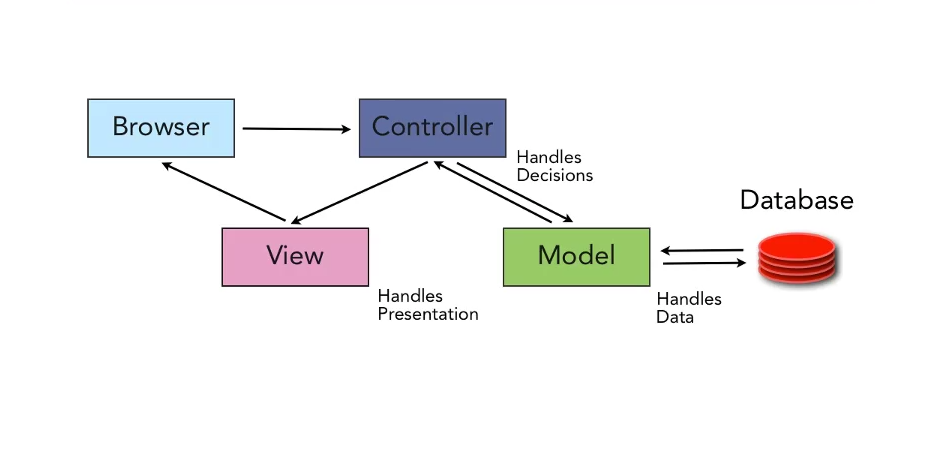

## Objectives

* Create a ActiveRecord Migration.
* Create an ActiveRecord Model.
* Migrate the Rails DB.
* Check the DB for the Table associated with the Model.
* Create a Seed file that will populate the DB.
* Populate the DB with this seed data.
* Use some ArticeRecord methods in the Rails console to find movies.
* Maintain a cheatsheet for all the Rails and Rack commands. 
* Add attributes to a Model.


### Model, View, Controller (MVC)

Rails is based on the MVC Architecture.



We will be only looking at the **Model** and **DB** in this lesson. 

We will come back to these two topics later, we will create the mimimal set of files needed at this time.

## Previous Lesson
[Initialize Rails Application](InitRails.md)

## Source Code/Implementation

**Note: The implementation of this lesson is in**
[`movies_crud_app`](https://github.com/tdyer/movies_crud_app)

## Setup 

This will build on the application created in the [Previous Lesson](InitRails.md).

Create a file .sqliterc in your home directory and add the below configuration. _This will configure the [sqlite3](http://zetcode.com/db/sqlite/tool/) command to produce friendlier output._

`~/.sqliterc`

```bash
.headers on
.mode column
.timer on
.echo off
.nullvalue "NULL"
```


## Generate a Movie Migration and Model

A Migration is a Ruby class that will generate SQL [Data Definition Statements (DDL) ](https://en.wikipedia.org/wiki/Data_definition_language) that will update a DB schema. _We will be adding and modifying a schema, (column names and data types), of a DB table.__

A Model is a Ruby class that is used to persist a specific __Resource__, Movie, in a DB table.

__Use a rails generator to generate a Migration and Model for the Movie resource.__

```
$ rails generate model Movie name:string rating:string desc:text length:integer
```

Notice that we generate two files.

* Migration file in `db/migrate/<timestamp>_create_movies.rb`
* Model file in `app/models/movie.rb.` 

## Migrate the DB by creating a DB Table.

__Open up the `db/migrate/<timestamp>_create_movies.rb` file.__

```ruby
class CreateMovies < ActiveRecord::Migration
  def change
    create_table :movies do |t|
      t.string :name
      t.string :rating
      t.text :desc
      t.integer :length

      t.timestamps null: false
    end
  end
end
```

This is the migration file that was generated above. It will create a **Table** in the **DB**. The table will be named `movies` and it will have **Seven** columns.

* name - a column that will be a Ruby String. This is typically a 'varchar' DB column type.
* rating - a column that will be a Ruby String.
* desc - a column that will be a Ruby String. This is typically a 'text' DB column type.
* length - a column that will be Ruby Fixnum. This is typically a 'integer' DB column type.
* id - a column that represents a **PRIMARY KEY (PK)** is a Ruby Fixnum. A __PK__ uniquely identifies a row in the table. This is a 'integer' DB column type and **MUST** exists.
* created_at - a column that will be a Ruby DateTime object. This is  a 'datetime' DB column type.
* updated_at - a column that will be a Ruby DateTime object. This is  a 'datetime' DB column type.

> Note: the `created_at` and `updated_at` columns are created by the t.timestamps in the migration. And the id column is automatically generated for every table.

[Rails Guide - Active Record Migrations](http://guides.rubyonrails.org/active_record_migrations.html)

#### Apply this Migration.

This will use the above ActiveRecord Migration to generate the SQL to CREATE a table with the above columns and apply it to the `development` DB. 

_Remember, by default Rails runs in development mode._

```
rake db:migrate
```

This will run the migration to create a *movies* table that has a id, name, rating, desc, length, updated_at and created_at columns. 

*Check the DB to confirm the existence of the movies table and the above columns*

```
rails dbconsole
```

This will bring up **[sqlite3](http://zetcode.com/db/sqlite/tool/)** command line utility to interact with the Rails development DB.

Lets look at all the tables in the DB. And describe the movies table. 

```
sqlite>
sqlite> .schema movies
CREATE TABLE "movies" ("id" INTEGER PRIMARY KEY AUTOINCREMENT NOT NULL, "name" varchar, "rating" varchar, "de\
sc" text, "length" integer, "created_at" datetime NOT NULL, "updated_at" datetime NOT NULL); 
sqlite> 
sqlite> 
```

We can see that the **DB Schema** shows we have a movies table with the correct table.

> Note: Control-D to exit the dbconsole.

### View the current DB Schema.

The current state of the DB Schema is kept in the schema.rb file. This file will get updated with each ActiveRecord Migation file you run.

Note, that the **version** is a timestamp. It's the same timestamp of the last migration that has been run or applied. 

_You'll be referring to the this file all the time, to remind yourself of the tables, thieir columns and data types._

**Open the db/schema.rb file.**

```ruby
ActiveRecord::Schema.define(version: 20160311041224) do

  create_table "movies", force: :cascade do |t|
    t.string   "name"
    t.string   "rating"
    t.text     "desc"
    t.integer  "length"
    t.datetime "created_at", null: false
    t.datetime "updated_at", null: false
  end

end
```

**This file will always reflect the current schema for the DB!**

## Movie Model

The other file generated above is in `app/models/movie.rb`.

```ruby
class Movie < ActiveRecord::Base
end
```

A Model is a Plain Old Ruby Class that inherits it's behavior from the ActiveRecord Ruby Class.

Rail's ActiveRecord class is based on the [Active Record Design Pattern](http://www.martinfowler.com/eaaCatalog/activeRecord.html)

Active Record allows one to __C__reate, __R__ead, __U__pdate and __D__elete rows in the `movies` table.

[ActiveRecord](http://guides.rubyonrails.org/active_record_basics.html) has **a lot** of behavior. We'll be discovering this piecemeal, as needed.

## Create seed data

At this point we have a `movies` table BUT it has not data in it. There are NO rows for any movies.

Let's populate the `movies` table in the DB.

**Add the below to db/seeds.rb**

```
# Delete All Existing Movies
Movie.delete_all

# Create three movies
Movie.create!(name: 'Affliction', rating: 'R', desc: 'Little Dark', length: 123)
Movie.create!(name: 'Mad Max', rating: 'R', desc: 'Fun, action', length: 154)
Movie.create!(name: 'Rushmore', rating: 'PG-13', desc: 'Quirky humor', length: 105)

puts "Created three Movies"
```

This uses the `ActiveRecord#create!` method to create a row in the `movies` table.

[ActiveRecord Rails Guide - CRUD: Reading and Writing Data](http://guides.rubyonrails.org/active_record_basics.html#crud-reading-and-writing-data)

**Add this seed data to the `movies` table.**

```
rake db:seed
```

This rake command will run the code in the db/seeds.rb file which will create three Movies in the DB using ActiveRecord.

> NOTE: the ActiveRecord#create! method will create a row in the `movies` table.

> In this case the `create!` method will take one argument, a Hash of key/values pairs where the key is the column and the value is the data for this row. 

**Check the DB with the dbconsole**

```
$ rails dbconsole

sqlite> SELECT * FROM movies;                                                   
SELECT * FROM movies;                                                           
1|Affliction|R|Little Dark|123|2016-03-11 04:44:47.297887|2016-03-11 04:44:47.2\
97887                                                                           
2|Mad Max|R|Fun, action|154|2016-03-11 04:44:47.306818|2016-03-11 04:44:47.3068\
18                                                                              
3|Rushmore|PG-13|Quirky humor|105|2016-03-11 04:44:47.309937|2016-03-11 04:44:4\
7.309937                                                                        
sqlite> 
```

Yes, we have three movies in the `movies` table.


**Check with rails console**

The Rails console will allow us to use the Rails models to view the models. _It provides a view into the Rails application code_.

```
$ rails console
```

The rails console is *VERY* important for debugging and checking rails.  


Run the below commands in the Rails console.  **Notice the SQL that is created by each of the below ActiveRecord methods.**

**Read Movies using the `Movie` model.**

```ruby
> m1 = Movie.first

> m1.name
"Affliction"
> m1.rating
"R"
> m1.length
123
>
> mlast = Movie.last
...
> mlast.name
"Rushmore"
>
> m2 = Movie.find(2)
> m2.name
"Mad Max"
>
> Movie.all
...
> Movie.find_by_name("Mad Max")
...
> Movie.find_by_rating("R")
...
> Movie.where(rating: "R")
...
```
What's going on here?

We are using Active Record methods to find models in the DB. 

* Movie.first - First row in the `movies` table.
* Movie.last - Last row in the `movies` table.
* Movie.find(2) - Row with a id = 2 in the `movies1` table.
* Movie.all - All rows in the `movies` table.
* `Movie.find_by_name("Mad Max")` - Find the _first_ movie in the table with a name of "Mad Max"
* Movie.where(rating: "R") - Find _all_ movies with a rating of "R". _Always returns an Array._

**ActiveRecord allow us to use Ruby models to Create, Read, Update and Delete data in the DB**.


[ActiveRecord Rails Guide - Active Record Basics](http://guides.rubyonrails.org/active_record_basics.html)

### Cheat Sheet
[Cheat Sheet](Cheatsheet.md)
Here's one to get you started on your own!


## Lab

* Create a Song resource in **in another Rails app**. Each Song will have a title, artist, desc, price and length. 

* The title and artist are simple strings, desc is a 'text' field because it could have a lot of text. What should the price and length types be? 

* Look up the rails guide for migrations and find out.

* Create a couple of songs in the db/seeds.rb file. 

* Don't forget to use the rails dbconsole and rails console commands to verify you've created 3 songs.


## Add another attribute/column to Movie/movies model and table.

We just had a request to capture the released year for each of our movies. Let's implement this.

**Generate a migration that add a released_year attribute to the Movie model.**

```
$ rails generate migration AddReleasedYearToMovie released_year:integer
...
```

Will generate a migration to add the released_year column to the movies table.

**Open `db/migrate/<timestamp>_add_released_year_to_movie.rb`**

```ruby
class AddReleasedYearToMovie < ActiveRecord::Migration
  def change
    add_column :movies, :released_year, :integer
  end
end
```

**Apply this migration to the movies table.**

```
$ rake db:migrate
```

**Check the db/schema.rb has been updated.**

```ruby
ActiveRecord::Schema.define(version: 20160311052554) do

  create_table "movies", force: :cascade do |t|
    t.string   "name"
    t.string   "rating"
    t.text     "desc"
    t.integer  "length"
    t.datetime "created_at",    null: false
    t.datetime "updated_at",    null: false
    t.integer  "released_year"
  end

end
```

**Update the seed data with the release year.**

```ruby
...
Movie.create!(name: 'Affliction', rating: 'R', desc: 'Little Dark', length: 123, released_year: 1997)
Movie.create!(name: 'Mad Max', rating: 'R', desc: 'Fun, action', length: 154, released_year: 2015)
Movie.create!(name: 'Rushmore', rating: 'PG-13', desc: 'Quirky humor', length: 105, released_year: 1998)
...
```
**Update the movies table**

```
$ rake db:migrate
```

**Check with the Rails console**

```
$ rails console
> Movie.first.released_year
> Movie.second.released_year
> Movie.last.released_year
>
> Movie.all.map(&:released_year)
> 
```

* Movie.all.map(&:released_year) - For each movie in the DB call the released_year method. This will return an Array of all the released years. _Uses Ruby's symbol to proc syntax._

## Lab

* Add a released year attribute to the Song model.

## Drop, Create, Migrate and Seed the DB.

This is often useful if you have messed up a migration or somehow introduced bad DB schema or data.

```
$ rake db:drop
$ rake db:create
$ rake db:migrate
$ rake db:seed
```

**Check the Movies using the Rails console!!*

## Add the `annotate` gem to your app.

The [annotate gem](https://github.com/ctran/annotate_models) to your application. 

This will add a comment summarizing the current schema to the top of your ActiveRecord models.

**Update the Gemfile**

```ruby
...
group :development, :test do
  gem 'annotate'
  ...
end
...
```

This will add the annote gem when this Rails application is running in the Rails development or test environments.

**Install the gem on your local machine from rubygems.org.**

```
$ bundle install
```

**Annotate your ActiveRecord Models. Your Movie and Song models.**

```
$ bundle exec annotate
```

**View the Annotations in the Movie ActiveRecord model, `app/models/movie.rb`.**

```ruby
# == Schema Information                                                         
#                                                                               
# Table name: movies                                                            
#                                                                               
#  id            :integer          not null, primary key                        
#  name          :string                                                        
#  rating        :string                                                        
#  desc          :text                                                          
#  length        :integer                                                       
#  created_at    :datetime         not null                                     
#  updated_at    :datetime         not null                                     
#  released_year :integer                                                       
#                                                                               

class Movie < ActiveRecord::Base
end
```

> See how this annotate command will generate comments that show the current state of your Model's attributes.

**Note: The implementation of this lesson is in**
[`movies_crud_app`](https://github.com/tdyer/movies_crud_app)


## Next Lesson
[Viewing all Movies](ControllerIndex.md)

## Resources
* [Rails Cheat Sheet](Cheatsheet.md)
* [sqlite3](http://zetcode.com/db/sqlite/tool/)
* [Rails Console Tips/Tricks](https://pragmaticstudio.com/blog/2014/3/11/console-shortcuts-tips-tricks)
* [Rails and Rake Commands](http://guides.rubyonrails.org/command_line.html)
* [Rails Guide - Active Record Migrations](http://guides.rubyonrails.org/active_record_migrations.html)
* [Rails Guide - Active Record Basics](http://guides.rubyonrails.org/active_record_basics.html)
* [PragStudio - RubyOnRails Level 1](https://pragmaticstudio.com/rails). This is a **very** good resource for learning Rails. They have been teaching Rails since the beginning and their teaching and presentation skill are **excellent**.


