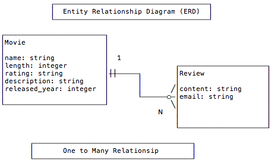

## Objectives


* Draw a Entity Relationship Diagram (ERD) that describes a __one to many relationship__ between entities.
* Create a One to Many relationship between DB tables.
* Use ActiveRecord to implement a __one to many relationship__.
* Use the Rails console to create __one to many relationships__, or __associations__, between models.
* Explore methods generated by ActiveRecord#has_many
* Explore methods generated by ActiveRecord#belongs_to
* Validate foriegn keys in DB.

## Previous Lesson

[Controller Cleanup](ControllerMisc.md)

## Source Code/Implementation

**Note: The implementation of this lesson is in the `has_many` branch of this repository**
[`movies_crud_app`](https://github.com/tdyer/movies_crud_app)

## Setup

Reset the DB. 

```bash
$ rake db:drop
$ rake db:create
$ rake db:migrate
$ rake db:seed
```

OR 

```bash
$ rake db:reset
...
``` 


## Data Modelling

Often, when we start thinking about a **Design** for our application we will create a **Data Model**. The Data Model represents the **Entities** in our application an the **relationships** between our **Entities**. 

> Entities are the "things" in our application. Often, but not always, an Entity will correspond to a Resource. For example, we've been working with the Movie Entity or Resource so far. 

> Often these **Entities** are indicated by the nouns in our **User Stories** or **Use Cases**, as we'll see below. 

In our case we already have a  **Movie Entity**. And next we'll want to create an **Review Entity** that will represent a review of the movie created by one the application's users.

For example, given we have the below User Stories:

> Allow any user to create a Review for a Movie.

> Allow a Movie to **have many** Reviews.

We will notice that we will need, at least, an entity for a Movie and a Review. And that the **relationship** between the Movie and Reviews are **one to many**. **One Movie may have many Reviews.**




A common way to create data models is to use [Crows Foot Notation](http://www.codeproject.com/Articles/878359/Data-modelling-using-ERD-with-Crow-Foot-Notation) to create a __Entity Relationship Diagram (ERD)__. The crows foot indicates the **many** side of the relationship. 

> In the case above we'll indicate the reviewer by capturing their email address in the review they create. Later, we'll change this.

## Implementing the Data Model

We want to be able to take the above Data Model and implement it in our Rails application. 

We already have our Movie Entity/Resource so we'll need to create a Review Entity/Resource. **And we'll have to implement the one to many relationship between a movie and it's reviews.**

We will be implementing the review and it's relationship to a movie in:

1. The Database.
2. The Movie and Review models.

### Database Relationships and Foriegn Keys.

In a Relational Database we use a **Foreign Key (FK)** to implement a one to many relationship. 

This **FK** is a column in one DB table that references the **Primary Key (PK)** in another DB table. The **FK** resides in the table for the MANY side of relationship.

For example.

#### movies table

|id |name       |rating | released_year | length | desc |
|:--|:----------|:------|:--------------|:-------|:-----| 
| 1 |Affliction | R     | 1997          | 123    | ...  |
| 2 |Mad Max    | R     | 2015          | 154    | ...  |
| 3 |Affliction | PG-13 | 1998          | 105    | ...  |

#### reviews table

|id |email            |content        | movie_id (FK) 
|:--|:----------------|:--------------|:--------------|
| 1 |moe@foo.com      | Great, ...    | 2             |
| 2 |larry@foo.com    | Boring, ...   | 1             |
| 3 |curly@foo.com    | Funny  ...    | 3             |
| 4 |larry@foo.com    | Action ...    | 2             |
| 5 |curly@foo.com    | Somber, yet...| 1             |

Notice that the relationship between a movie and it's reviews is maintained by the `movie_id` column in the `reviews` tables. This is the `reviews` table FK to the movie it **belongs to**. 

**The FK lives in the table for the MANY side of the relationship AND it uniquely identifies the ONE side of the relationship**

See how the FK, `movie_id`, column identifies the reviewed movie. 

In the above case:  

* Afflication has two reviews.
	* Larry's says it's "Boring,...".
	* Curly says it's "Somber, yet ...". 
* Mad Max has two reviews.
	*  Moe thinks its great.
	*  Larry comments on the action.
* Rushmore has one review.
	* Curly thinks it's funny.

All good, so let's create the `reviews` table and the `Review` ActiveRecord model.

#### Create the Review

> First, we'll create the `reviews` table and it's `Review` model.
 
```bash
$ rails g model Review content:string email:string movie:references
```

> Run the migration to create the table in the DB.

```bash
$ rails db:migrate
```

> Here's the migration generated.  

```ruby
class CreateReviews < ActiveRecord::Migration
  def change
    create_table :reviews do |t|
      t.string :content
      t.string :email
      t.references :movie, index: true, foreign_key: true

      t.timestamps null: false
    end
  end
end
```

> Notice the t.references. It will create a column, named `movie_id`, that will be the column that will act as **FK** to a movie. It will contain a movie's **Primary Key Value**.

> Let's take a look at the DB schema in the `db/schema.rb`


```ruby
...
 create_table "reviews", force: :cascade do |t|
    t.string   "content"
    t.string   "email"
    t.integer  "movie_id"
    t.datetime "created_at", null: false
    t.datetime "updated_at", null: false
  end

  add_index "reviews", ["movie_id"], name: "index_reviews_on_movie_id"
  ...
```

> This shows how we create a `reviews` table with a FK column `movie_id`. 
> 
> `The add_index "reviews" ` line just adds a Database Index for the review table's `movie_id`. This is a performance enhancement that will speed up the look up of reviews by movie id.
> 


#### Update the Movie and Review model class.

There are two methods that are needed to manage relationships/associations between ActiveRecord models.

##### belongs_to

The first one is the `belongs_to` method. It should exist in the model on the MANY side of the relationship. In this case the Review model is the MANY side of the relationship.

**View `app/models/review.rb` generated above.**

```ruby
class Review < ActiveRecord::Base
  belongs_to :movie
end
```

The `belongs_to` gives the Review model a set of methods that can be used to access the ONE side of the relationship. The Movie model.

##### belongs_to

The `has_many` method should exist in the ONE side of the relationship. In our case the Movie model.

**Add `has_many` to the Movie model.**

```ruby
class Movie < ActiveRecord::Base

  # The movie may have reviews                                                            
  has_many :reviews
...
end
```

#### Create Movie Reviews.

Let's create some movie reviews. Along the way we'll see how ActiveRecord gives you a bunch of really wonderful methods for managing relationships between models.

**Start up the Rails console**

```ruby
>
> m2 = Movie.second
>
> m2.reviews
SELECT "reviews".* FROM "reviews" WHERE "reviews"."movie_id" = ?  [["movie_id", 2]]
=> #<ActiveRecord::Associations::CollectionProxy []>
>
```

> The `has_many` method we added to the Movie model gave the Movie the `reviews` method. Invoking this method on a model will generate the SQL SELECT to find all the reviews for this movie. Pretty cool, huh?.

> Now, let's create a review for this movie.

```ruby
>
>  m2.reviews.create(content: 'Great, lotsa fun', email: 'moe@foo.com')
INSERT INTO "reviews" ("content", "email", "movie_id", "created_at", "updated_at") VALUES (?, ?, ?, ?, ?)  [["content", "Great, lotsa fun"], ["email", "moe@foo.com"], ["movie_id", 2], ["created_at", "2016-03-27 04:22:53.266903"], ["updated_at", "2016-03-27 04:22:53.266903"]]
>
> Review.count
1
> Review.first
SELECT  "reviews".* FROM "reviews"  ORDER BY "reviews"."id" ASC LIMIT 1
=> #<Review id: 1, content: "Great, lotsa fun", email: "moe@foo.com", movie_id: 2, create\
d_at: "2016-03-27 04:22:53", updated_at: "2016-03-27 04:22:53">
> 
```

> The `reviews.create` method allows us to create a Review specifically for this Movie. Notice how we didn't need to set the `movie_id` when creating the review. This was automagically done for us by Rails.


## You Do

Check the Database using `$ rails dbconsole`. Make sure that you understand each table, it's columns and the columns datatypes.

* In the rails console, create more reviews for each movie. 
* Check the `reviews` table in the DB afterwards. Note how the FK `movie_id` references the review's movie.
* Diagram the physical model, that is each table in the DB and their columns. *Keep this around, we'll be updating it as we continue.*

## Populate the Movie Reviews.

Populate the movie reviews.

**In the `db/seeds.rb`**

```ruby
...
# Must delete all reviews before movies, no ophans.
Review.delete_all
Movie.delete_all
...
m1 = Movie.create!(...)
m2 = Movie.create!(...)
m3 = Movie.create!(...)
...
# Create a couple of movie reviews                                                                                                  
m2.reviews.create!(content: 'Great fun', email: 'moe@foo.com')
m1.reviews.create!(content: 'Boring, ho hum', email: 'larry@foo.com')
m3.reviews.create!(content: 'Funny, ha', email: 'curly@foo.com')
m2.reviews.create!(content: 'Action packed', email: 'larry@foo.com')
m1.reviews.create!(content: 'Somber, yet interesting', email: 'curlyfoo.com')

puts "Create a couple of movie reviews"
```

```
$ rake db:reset
```

## Active Record Associations


These **has many** and **belongs to** relationships/associations are implemented in the database by using **foreign keys**. And they are implemented in ActiveRecord Models by using **belongs_to** association and the **has_many** association. [See Active Record Associations](http://guides.rubyonrails.org/association_basics.html)

### Terminology

In the above relationship we often say that there is a **parent-child** relationship between the models. In this case **Movie is the parent and Review is the child.** 

Also, we'll say that Movie has a **collection** of reviews. And that there is a **one to many** association between these two entities. **One Movie will have many Reviews**.


## Rails: `has_many`


Including `has_many` in an ActiveRecord model defines a series of methods on the model for accessing an associated **collection** of objects. For example, if we have a `Movie` model and include `has_many :reviews`, we will be able to get a particular Movie's entire set of reviews by `Movie.find(1).reviews`.

Just like `attr_accessor`, `has_many` is a macro that defines methods for us. You can think of the methods it defines as specialized setters and getters, as well as additional methods for dealing with database records. A list of all the methods generated by `has_many` can be found in the [ActiveRecord::Associations::ClassMethods documentation](http://api.rubyonrails.org/classes/ActiveRecord/Associations/ClassMethods.html#method-i-has_many).

Supposing a `Movie` that `has_many :reviews`, the list of generated methods is:

1. `Movie#reviews`
1. `Movie#reviews<<`
1. `Movie#reviews.delete`
1. `Movie#reviews.destroy`
1. `Movie#reviews=`
1. `Movie#review_ids`
1. `Movie#review_ids=`
1. `Movie#reviews.clear`
1. `Movie#reviews.empty?`
1. `Movie#reviews.size`
1. `Movie#reviews.find`
1. `Movie#reviews.exists?(name: 'ACME')`
1. `Movie#reviews.build`
1. `Movie#reviews.create`
1. `Movie#reviews.create!`

## You Do: `has_many` Methods

Each of you will research one method.

* Describe what the method does in your own words.
* Is it a setter, a getter, or something else? 
* Give an example of another one-to-many relationship, where you would define `has_many`.
* How you would use the method you just researched.

## Rails: `belongs_to`


Including `belongs_to` in an ActiveRecord model defines a series of methods on the model for accessing a **single** associated object. For example, if we have a 

> Open the `$ rails console`

```ruby
> rlast = Review.last
> rlast.movie
SELECT  "movies".* FROM "movies" WHERE "movies"."id" = ? LIMIT 1  [["id", 1]]
=> #<Movie id: 1, name: "Affliction", rating: "R", desc: "Little Dark", length: 123, created_at: "2016-03-27 04:45:25", updated_at: "2016-03-27 04:45:25", released_year: 1997>
>
```

The **belongs_to** method will provide the `movie` method that will generate and run a SQL SELECT statement to find the Movie that this review belongs to.


How do you decide where to put the `has_many` and `belongs_to` macros? Well, you can ask yourself a few questions:

1. Is the model associated with a collection of other models? (movies have a collection of reviews). If yes, include `has_many`.
1. Is the model associated with a single object? (review is associated with a single movie). If yes, include `has_one` or `belongs_to`.
1. Does the model's database table hold a foreign key column? If yes, include `belongs_to`.

The "children" in parent-child relationships, or the "many" in one-to-many relationships hold the foreign key, and therefore will need `belongs_to` on the ActiveRecord model.

`belongs_to` defines several methods for us. A list of the methods generated by `belongs_to` can be found in the [ActiveRecord::Associations::ClassMethods documentation](http://api.rubyonrails.org/classes/ActiveRecord/Associations/ClassMethods.html#method-i-belongs_to)

Supposing a `Person` that `belongs_to :Movie`, the list of generated methods is:

1. `Review#movie`
1. `Review#movie=(some_movie)`
1. `Review#build_movie`
1. `Review#create_movie`
1. `Review#create_movie!`

## You Do: Creating Associated Records
-------------------------------------

Create the relationship between Articles and Comments. Articles will **have many** Comments and Comments will **belong to** an Article. 

* Draw the Data Model using Crows Foot Notation.
* Create and apply the migration, use the rails generator to create the migration.
* Check that the migration worked by checking the DB tables.
* Create the Active Record models with the appropriate  `has_many` and `belongs_to`.
* Create a couple of Articles and Comments in the rails console.
	* Create and associate a artice with a comment. Invoke the `create!` method on the article's `comments` method.
	* Associate a comment with an article. Invoke the `article` method on a comment.
* Check the DB to make sure the correct foreign keys are being created.
* Find the SQL that is generated and invoked.
* Seed the DB with these articles and comments.

## Next Lesson

[Nested Resources](NestedResources.md)

Resources
---------

* [Rails Association Basics](http://guides.rubyonrails.org/association_basics.html) Read the sections on belongs_to and has_many.
* [ActiveRecord Basics](http://guides.rubyonrails.org/active_record_basics.html)
* [Rails Documentation](http://api.rubyonrails.org/)
* [Debugging Rails with the byebug Gem](http://guides.rubyonrails.org/debugging_rails_applications.html#debugging-with-the-byebug-gem)
* [With So Much Rails to Learn, Where Do You Start?](http://www.justinweiss.com/blog/2015/05/25/with-so-much-rails-to-learn/)
* [Migration Native Types](http://api.rubyonrails.org/classes/ActiveRecord/ConnectionAdapters/TableDefinition.html#method-i-column)
* [Rails Schema Statements](http://api.rubyonrails.org/classes/ActiveRecord/ConnectionAdapters/SchemaStatements.html)
