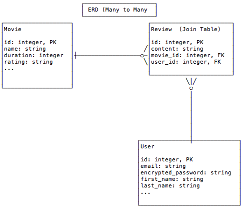

## Objectives


* Draw a Entity Relationship Diagram (ERD) that describes a __many to many relationship__ between entities.
* Create a Many to Many relationship between Users and Movies.

## Previous Lesson

[Authorization](Authorization.md)


## Overview

In this lesson we are going to create a one to many relationship between a user and the reviews it has created.

Remember that previously we created a one to many relationship between a movie and it's reviews.

Because we have two one to many relationships for reviews we have, as a side effect, also created a many to many relationship between a movie and the user's that have reviewed that movie.

**Users may have Reviewed many Movies.** 

And 

**Movies may have been Reviewed by many Users.** 

In this case we say that the Review is **Join Model** between the User and Movie models.

## Data Model




## Source Code/Implementation

**Note: The implementation of this lesson is in the `has_many` branch of this repository**
[`movies_crud_app`](https://github.com/tdyer/movies_crud_app)

## Setup

Reset the DB. 

```bash
$ rake db:reset
``` 


## Implementing the Data Model


#### Make the `reviews` table a join table.

Previously we had recorded the user's email that had created a review. But, now that we have a User model we should use that to indicate who created the review.

So, we'll:

* Remove the email column from the `reviews` table.
* Add a foreign key (FK) column, `user_id`, to the `reviews` table to indicate who created the review.
* This `user_id` FK column will also create a one to many relationship between the user and their reviews.

Let's remove the `email` column from the `reviews` table and add a **foreign key** column for users to the `reviews` table.

> Create a migration with a timestamp.

```
$ rails g migration MakeReviewsAJoinTable
```

> Add code to this migration to remove the email and add a foreign key for users.

```ruby
class MakeReviewsAJoinTable < ActiveRecord::Migration

  # Invoked when migrating up                                                                                          
  def up
    # Remove all rows before changing the schema                                                                       
    Review.delete_all
    remove_column :reviews, :email
    add_column :reviews, :user_id, :integer
  end

  # Invoked when migrating down or rolling back                                                                        
  def down
    # Remove all rows before changing the schema                                                                       
    Review.delete_all
    add_column :reviews, :email, :string
    remove_column :reviews, :user_id
  end
end
```

> Now migrate the DB.

```
$ rake db:migrate
```


> Check the DB schema for the reviews table.```

Now we can see that the `reviews` table is a **JOIN TABLE** between the `users` and `movies` table. **It has a foreign key (FK) for the two tables it joins.**


##### (Reminder) Database Relationships and Foriegn Keys.

In a Relational Database we use a **Foreign Key (FK)** to implement a one to many relationship. 

This **FK** is a column in one DB table that references the **Primary Key (PK)** in another DB table. The **FK** resides in the table for the MANY side of relationship.

#### Make the Review Model a Join model.

Let's add the rails statements that implement the one to many relationship between the User and Review models.

> Add `belongs_to :user` to the Review model.
>
> And remove the email validation, Review no longer has an email attribute.

```ruby
class Review < ActiveRecord::Base
  ...
  belongs_to :user
  ...
  # remove the validation for email.
end  
```

> Add `has_many` to the User model.

```ruby

class User < ActiveRecord::Base
  has_many :reviews, dependent: :destory
  ...
end
```

Now we have a one to many relationship from User to Review. A User may have one or more reviews.


## Seed the DB.

> Change the reviews to `belong to` users.

```ruby
...
moe = User.create!(email: 'moe@foo.com', password: 'password', password_confirmation: 'password', first_name: 'Moe', last_name: 'Howard', admin: false)
larry = User.create!(email: 'larry@foo.com', password: 'password', password_confirmation: 'password', first_name: 'Larry', last_name: 'Fine', admin: false)
curly = User.create!(email: 'curly@foo.com', password: 'password', password_confirmation: 'password', first_name: 'Curly', last_name: 'Howard', admin: false)

# Create an admin user                                                                                             
tom = User.create!(email: 'tom@foo.com', password: 'password', password_confirmation: 'password', first_name: 'Tom', last_name: 'Jones', admin: true)

puts 'Created a couple of Users'

# Create a couple of movie reviews                                                                                 
m2.reviews.create!(content: 'Great fun', user: moe)
m1.reviews.create!(content: 'Boring, ho hum', user: larry)
m3.reviews.create!(content: 'Funny, ha', user: curly)
m2.reviews.create!(content: 'Action packed', user: larry)
m1.reviews.create!(content: 'Somber, yet interesting', user: curly)

puts "Create a couple of movie reviews"
...
```

#### movies table

|id |name       |rating | released_year | length | desc |
|:--|:----------|:------|:--------------|:-------|:-----| 
| 1 |Affliction | R     | 1997          | 123    | ...  |
| 2 |Mad Max    | R     | 2015          | 154    | ...  |
| 3 |Rushmore   | PG-13 | 1998          | 105    | ...  |

#### reviews table (JOIN TABLE)

|id |user_id (FK) |content        | movie_id (FK) 
|:--|:------------|:--------------|:--------------|
| 1 |1            | Great, ...    | 2             |
| 2 |2            | Boring, ...   | 1             |
| 3 |3            | Funny  ...    | 3             |
| 4 |2            | Action ...    | 2             |
| 5 |3            | Somber, yet...| 1             |

#### users table 

`select id, email, first_name, last_name, admin from users;`

|id |email         |first_name   | last_name     | admin
|:--|:-------------|:------------|:--------------|------
| 1 |moe@foo.com   | Moe         | Howard        | f
| 2 |larry@foo.com | Larry       | Fine          | f
| 3 |curly@foo.com | Curly       | Howard        | f
| 4 |tom@foo.com   | Tomly       | Jones         | t

Notice that the relationship between a movie and it's reviews is maintained by the `movie_id` column in the `reviews` tables. This is the `reviews` table FK to the movie it **belongs to**. 

**The FK lives in the table for the MANY side of the relationship AND it uniquely identifies the ONE side of the relationship**

See how the FK, `movie_id`, column identifies the reviewed movie. 

In the above case:  

* Afflication has two reviews.
	* Larry's says it's "Boring,...".
	* Curly says it's "Somber, yet ...". 
* Mad Max has two reviews.
	*  Moe thinks its great.
	*  Larry comments on the action.
* Rushmore has one review.
	* Curly thinks it's funny.


## Update the Reviews Controller/Views

Now, we need to update the Reviews Controller, Actions and Views to account for the changes made above.

#### Update the review index view.

> Show the reviewer.

```html
...
 <li> <%= truncate(review.content, length: 10) %>
    | <em>Reviewed by <%= link_to(review.user.full_name, users_path(review.user)) %></em>
    | <%= link_to("Show", movie_review_path(@movie.id, review.id)) %>

  </li>
...  
```

#### Update the review show view.

> Get the user via the `Review#user` method.

```html
...
<h2><%= @review.user.email %>'s review of <%= link_to(@review.movie.name, movie_path(@movie)) %></h2>
...
```

### Update the new review form.

> Review the email field from the form partial, `app/views/reviews/_form.html.erb`

### Update the Review create action

> Add the reviewer for this new review. _The currently logged in user._

```ruby
def create
...
  # Add the reviewer                                                                                             
  @review.user = current_user
...
  if @review.save
```

### Show a user's movie reviews.

> Update the user show view, `app/views/user/show.html.erb`

```html
<!-- User movie reviews -->
<p>
  Movie	Reviews
  <ul>
    <% @user.reviews.each do |review| %>
     <li><%= link_to('Review', movie_review_path(review.movie, review)) %> 
     for <%= review.movie.name %>,
     created <%= time_ago_in_words(review.created_at) %> ago</li>
    <% end %>
  </ul>
</p>

```

### Show user view after login.

> Let's show the view for the currently logged in user after they have authenticated.
 
**Add this to the `app/controllers/application_controller.rb`**


```ruby
...
  # Redirect to the current user show view after                                                                   
  # login                                                                                                          
  def after_sign_in_path_for(resource)
    user_path(resource)
  end
..  
```

## Many to Many Relationship.

Rails allows one a very nice way to determine many to many relationships **through** a join model.

For example, say we're given the following use case:

**In the Movie show view show all the users that have reviewed this movie.**

We can implement this using Rails [has_many :through](http://guides.rubyonrails.org/association_basics.html#the-has-many-through-association)

Let's take a minute to look at the Rails Guide describing this. [Has Many Through](http://guides.rubyonrails.org/association_basics.html#the-has-many-through-association)

> Now lets implement the Use Case above.

**In the `app/models/movie.rb` has a `has_many :through` method.**

```ruby
class Movie < ActiveRecord::Base
...
 # The users that have reviewed movies                                                                            
  has_many :users, through: :reviews
...   
```

Notice how this is using the Review model as a Join Model to implement the many to many relationship between users and movies.

> Lets add some code to the the movie show view to show us the name of this movie's reviewers.

**Add this to the `app/views/movies/show.html.erb` view.**

```html
...

<!-- Show the Users that have reviewed this movie -->
<p>
  <%= @movie.name %> been reviewed by
  <% unless @movie.users.empty? %>
    <%= @movie.users.uniq.map(&:full_name).join(', ') %>
  <% else %>
    no users.
  <% end %>
</p>
...
```

This will get all the users that have reviewed this movie. _Yes, a user can review  movie more than once._ And show the reviewer's name.

## You Do

Create a many to many relationship from Users to Movies. For example, implement this use case.

**Allow one to view all the movies a user has reviewed.**

Resources
---------

* [Rails Association Basics](http://guides.rubyonrails.org/association_basics.html) Read the sections on belongs_to and has_many.
* [Has Many Through](http://guides.rubyonrails.org/association_basics.html#the-has-many-through-association)

