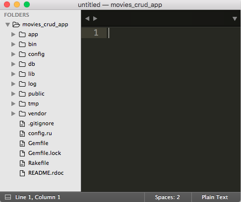
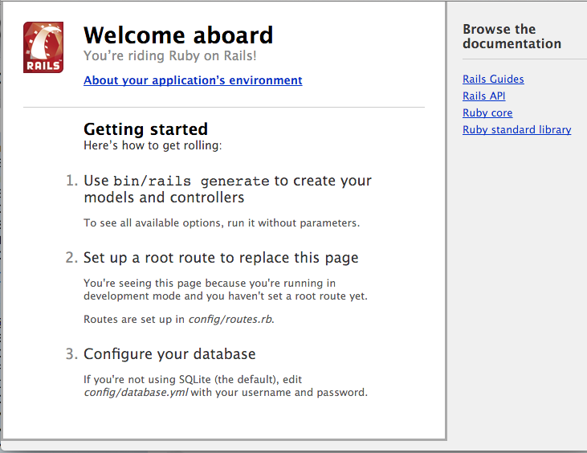

## Objectives
* Draw Diagrams that show the flow of a HTTP Requests and Responses and the how the Model, View and Controller interact.
* Start to create a cheatsheet for all the Rails and Rack commands. 
* Create a Rails backend app.
* Review the file/directory structure for Rails.
* Initialize the DB for this Rails application.
* Start the Rails app and access it.

**Note: The implementation of this lesson is in**
[`movies_crud_app`](https://github.com/tdyer/movies_crud_app)


### Model, View, Controller (MVC)

Rails is based on the MVC Architecture.


* A **HTTP Request** is sent from the **Client**, (browser/curl).
* The **URL Path** will determine what **Controller** will be executed.
* The **URL Path** will uniquely indentify a **Resource**, (Song, Movie, Person, ...), this is implemented as **Model**.
* This **Resource** and it's current state is persisted/stored in a **DB** table.
* The **Representation** of this **Resource** is built by the **View**. The **Representation** could be in HTML, JSON, XML, PDF and Image, etc.

We'll talk more about this architecture as we progress. And we'll see how an HTTP Request/Response flows thru and app.

## Setup

Create a file that will reduce the number of files installed by Ruby Gems and Rails.

> Change directory, `cd`, to your home directory and create a `.gemrc` file.
> 
> This will tell Ruby Gems to skip installing documentation for gems. _Saves times and disk space._
> 

```bash
$ cd ~
$ echo 'gem: --no-rdoc --no-ri' > .gemrc
```
## Create a new Rails application.


###Install Rails.

*Note: this can be done from within any directory*


* Let's see what versions of rails we have installed already. 

> Show all the Ruby Gems with 'rails' in it's name.

```
$ gem list |grep rails
``` 

* Let's install the lastest version of rails.

```
$ gem install rails
```

### Create a Rails application.

Create a Rails app that will use a SQLite DB

```
$ rails new movies_crud_app -T 
```

This will create a Rails application named `movies_crud_app`.

The -T option, or --skip-test-unit, option will exclude the tests from this Rails app. _We'll learn about testing later._

This will: 

* Create a directory named `movies_crud_app` that will contain all the directories, files and code for a baseline Rails application.
* Get all of the Ruby Gems needed by this application as indicated in this application's Gemfile. _These gems will be downloaded from `https:://rubygems.org` if they don't already exist on your local machine._

**Gemfile.rb**

```ruby  
source 'https://rubygems.org'

# Bundle edge Rails instead: gem 'rails', github: 'rails/rails'                                               
gem 'rails', '4.2.5.1'
	...
	
```

* Install Ruby Gems. This will install the ruby gems on your local system/machine.

```bash
$ bundle install
```

> Note: that it may stall for a couple of minuts after the `bundle install` command. This is because Rails is loading and installing all the Ruby Gems and their dependencies for the app that are listed in the `Gemfile`.

### Review Rail application directory structure.

Change into this `movies_crud_app` directory and take a look at how Rails gives you a very clear location to place all the code you'll be writing.


```
$ cd movies_crud_app
$ subl .
```

All Rails apps are structured in a very specific way. This is called **Convention Over Configuration**. The creator of Rails [David Heinemeier Hansson (DHH) ](http://david.heinemeierhansson.com/) has strong opinions about web and software development. So, he has determined the **convention** about where in the directory hieracharcy each file should reside. In fact, Rails is often described as a *strongly opioniated*. 

Another words, there are very specific and consistent locations in the directory structure for code that serves a specific purpose. 

All Rails application maintain these consistent locations for code and other artifacts needed for our application. _IMO, this is one of key reasons Rails has been so popular and effective._

#### Rails Application Structure.



The **bold** directories are where we'll be writing the vast majority of our application's code.

* __app - Where most code for you application exists.__
* bin - Scripts used by rails. _We won't be working in here._
* __config - Contains configuration and code that will be excecuted when this app is initialized, i.e. startup code and configuration.__
* __db - Contains code needed to setup and populate the DB.__
* lib - General Ruby code that is needed by the app that doesn't fall into the Model/View/Controllers.
* log - Log files. Files generated by a running Rails app that record the operations of the app. _We'll be looking at this a lot._
* public - Mix of front-end files, (HTML, CSS, Images), that are mostly generated within your web application.
* tmp - Temp files.
* vendor - Files used for 3rd party libraries that are not gems.


## Rails Environments

By default, Rails can run in three different environments.

### Development Mode (Default Mode)

The mode the app is in when developers are writing code and developing the app. 

One great feature of this mode is that we don't have to restart the server after our code changes. __Changes are automatically picked up by the running Rails app.__

### Testing Mode

The mode the app is in when it's being tested. When we run our tests this is the mode we are running in.

### Production Mode

The mode the app is in when it's __live__, "In Production", being used online.

__By Default the Rails application will start in Development Mode.__

#### Configuration for each Environment/Mode.

Take a look at the configuration for each mode.

```bash
$ cd config/environments
$ ls
development.rb  production.rb   test.rb
```

Each file will configure each of the Rails environments. 


For example, the development.rb file will configure the app so that on every HTTP Request the app's relevant code will be reloaded. _This will pick up any changes to your code since the last request!_

**The config file for the development environment, `app/environments/development.rb`**

```ruby
 # In the development environment your application's code is reloaded on                                     
 # every request. This slows down response time but is perfect for development                               
 # since you don't have to restart the web server when you make code changes.                                
  config.cache_classes = false
```

## Create a database for this rails app. 

**Rails applications always need a DB to store or persist it's data.**


* Create a database.

```
$ rake db:create
```

This will create __TWO__ Databases.  One each for the `development` and `test` environments.

> Note: For sqlite these DBs are just files in the `db` directory, `db/development.sqlite3` and `db/test.sqlite3`

Open up the `config/database.yml` file. This is a YAML file use to configure a DB for each Rails environment.

> NOTE: YAML is "Yet Another Markup Language"

Notice, how each environment's database is named after the environment and app name.

__In the config/database.yml file:__

```
...
database: movies_crud_app_development
...
database: movies_crud_app_test
...
database: movies_crud_app_production
```

## Start the Rails app.
```
$ rails server
```

**Access the default Rails URL.**

In your browser, go to this app running on your local machine, `localhost`, port `3000`.  

`http://localhost:3000`.

Ya, you should see the Welcome Aboard page. Rails is running!!!




## Lab

* Create a Rails application for tracking Songs. It will named `songs_crud_app`.

* Initialize the App.
* Start the App on the default port.
* Start the App on port 3333
	
```bash
$ rails server -p 3333
```

* Access the app and explore the links of the Welcome Page.

* Read the [Rails Guide - Getting Started](http://guides.rubyonrails.org/getting_started.html), up to section 4.2.


## Next Lesson!!

[Migrations and Models](CreateMigrationModel.md)

## Resources

* [Rails Guide - Getting Started](http://guides.rubyonrails.org/getting_started.html)
* [PragStudio - RubyOnRails Level 1](https://pragmaticstudio.com/rails). This is a **very** good resource for learning Rails. They have been teaching Rails since the beginning and their teaching and presentation skill are **excellent**.

