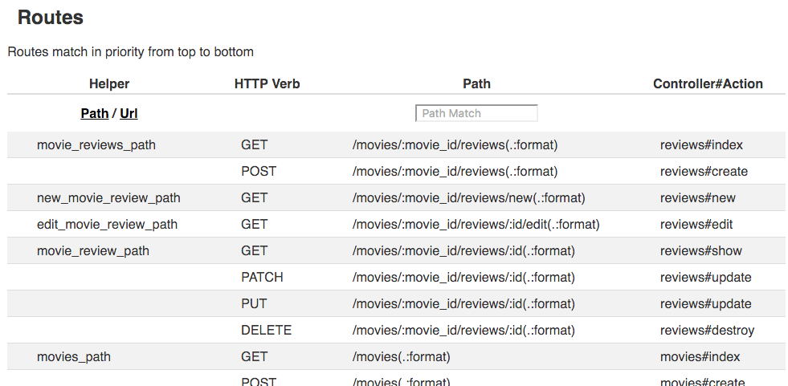
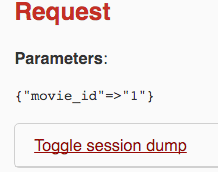

## Objectives


* Nested Resources.

## Previous Lesson

[Active Record Has Many](HasMany.md)

## Source Code/Implementation

**Note: The implementation of this lesson is in the `nested_resources` branch of this repository**
[`movies_crud_app`](https://github.com/tdyer/movies_crud_app)

## Setup

Reset the DB. 

```bash
$ rake db:drop
$ rake db:create
$ rake db:migrate
$ rake db:seed
```

OR 

```bash
$ rake db:reset
...
``` 

## Nested Resource.

Now that we have implmented movie reviews in both the DB and using Rails Models we'd like to expose these reviews to our users. So, we'll need routes, controller and views for the Review resource.

But, we need to think of how the user may want to manage the reviews. Will they want to show all the reviews for all the movies? Or should we show the reviews in the context, or scope, of a movie?

Let's assume that we have the following **User Story**.

**A user show be able to view all the reviews for a specific movie.**

OK, we have our User Story and it says that we need to ONLY show the reviews for a specific movie.

According to the above User Story we need to show the Reviews for a specific Movie. The Review resource will be a **Nested Resource**. The Review is **Nested** inside the Movie Resource.


How would we implement this?

## Create a Route for the Nested Resource.

**Add this to the routes.**

```ruby
resources :movies do
    # The review resource is nested inside the
    # movie resource                                                                       
    resources :reviews
  end
	
```

This will have created a set of nested routes for the **nested** review resource. _Lets take a look at these nested routes._

**Go to `http://localhost:3000/rails/info/routes`**



Great, we have a set of routes for the review nested resource. _But, we have no controller or views._

Let's try to see all the reviews for the first movie, "Affliction". 

**Go to `http://localhost:3000/movies/1/reviews`**

Notice that we have formed a URL for a nested resource. This nested resource URL will have the name of the parent resource, followed by the id of parent resource, followed by the name of the child resource.

When we access this page will fail because there is no controller or views for the review resource.

If we scroll down the error page we'll be able to see the **Request Parameters** sent from `/movies/1/reviews`.



See how Rails translated the request path `/movies/1/reviews` into the params hash `{"movie_id" => "1" }.

Now that we know the how to get the parent resource we can write the controller and views needed to show a movie's reviews.

## Show a Movie's reviews.

**In the Review controller, `app/controller/reviews_controller.rb`**

```ruby
class ReviewsController < ApplicationController
  
  # set the @movie instance variable before each action
  before_action :set_movie

  # GET /movies/:movie_id/reviews
  def index
    @reviews = @movie.reviews
  end

  private

  # set the @movie instance variable from the                                                                        
  # movie id in the params hash  
  def set_movie
    @movie = Movie.find(params[:movie_id])
  end
end
```

Notice how we are using a before filter to always get 
a movie instance variable, @movie. This @movie variable will be used in all the ReviewControllers actions and some of the review's views. 

And we are, once again, getting the many side of the one to many relationship between a movie and it's reviews. **We are using the `Movie#reviews` method that was added by the `has_many :reviews` in the Movie model.**

#### Let's create an index view for reviews.

**In the index view for reviews in `app/views/reviews/index.html.erb`.**

```html
<header>
  <h1>Reviews for <%= link_to(@movie.name, @movie) %></h1>
</header>
<ul>
  <% @reviews.each do |review| %>
  <li><%= truncate(review.content, length: 10) %>
    | <%= link_to("Show", movie_review_path(@movie.id, review.id)) %>
  </li>
  <% end %>
  <hr/><br/>
  <%= link_to "Create a New Movie", new_movie_review_path(@movie.id) %>
</ul>
```

In the view we're using a couple of **URL helpers** that where generated by the nested route. We are using the `movie_review_path` and the `new_movie_review_path` URL helpers in this view.

> Notice that we do NOT have a way to edit or delete reviews. We're not going to allow user's to perform these operations unless they login and have authorization.
> 
> We'll add these later after we implement login/authorization.

**Now when we go to `http://localhost:3000/movies/1/reviews`**

We should see all of Affliction's reviews.

#### Lets also add a link show all a movie's review in the movie's show view.

**In the `app/views/movies/show.html.erb` add.**

```html
<p>
  <%= @movie.name %> has
  <%= link_to_unless(@movie.reviews.empty?, "#{@movie.reviews.size} reviews", movie_reviews_path(@movie.id)) do
      "no reviews"
   end
  %>
</p>
```

This will show the number of reviews as well as a link to reviews for a movie.

## Show one review.

**In the `app/controllers/reviews_controller.rb`**

```ruby
 # GET /movies/:movie_id/review/:id 
 def show
   # Find a review for movie.
   @review = @movie.reviews.find(params[:id])
 end
```

**In the `app/views/reviews/show.html.erb` file.**

```html
<header>
  <h2><%= @review.email %>'s review of <%= link_to(@review.movie.name, movie_path(@movie)) %></h2>
</header>
<p>
  <%= @review.content %>
</p>
```

## Create a new review.

#### First we'll create a link to the allow us to create a user.

**In the movie show view, `app/views/movies/show.html.erb`.**

```html
<p>
Create a <%= link_to 'Review', new_movie_review_path(@movie.id) %>
</p>	
```

#### Create new action in the ReviewsController.

This will display the form to create a new movie.

```ruby
...
  # GET /movies/:movie_id/review/:id 
  def new
    # create an empty review, no attributes, for a movie.                                                          
    # empty review is needed by the form_for helper                                                                
    @review = @movie.reviews.new
  end
...
```

This will create an empty review model object. Needed by the `form_for` helper to populate the form.

#### Create a new view.

**In `app/views/reviews/new.html.erb`**

This will render the form to create a review.

```html
<p>
  Create a Review for the Movie <%= link_to @movie.name, movie_path(@movie) %>
</p>

<%= render partial: 'form' %>
```

Basically, renders the form partial.

#### Create new form partial

**In `app/views/reviews/_form.html.erb`**

Very much like the movie form partial. But, it will:

* Need an array containing the parent, movie, and child, review. 
* Have a different set of form fields.


```html
<!-- Helper to generate a HTML Form -->
<%= form_for([@movie, @review]) do |f| %>

<% if @review.errors.any? %>
<div id="error_explanation">
  <h2><%= pluralize(@review.errors.count, "error") %> prohibited this movie from b\
    eing saved:</h2>

  <ul>
    <% @review.errors.full_messages.each do |message| %>
    <li><%= message %></li>
    <% end %>
  </ul>
</div>
<% end %>

<fieldset>
  <ul>
    <li>
      <!-- Helpers to generate a email field for the user creating the review -->
      <%= f.label :email %>
      <%= f.email_field :email, autofocus: true %>
    </li>
    <li>
      <!-- Helper to generate a text area for the review content -->
      <%= f.label :content %>
      <%= f.text_area :content %>
    </li>
  </ul>
  <p>
    <%= f.submit %><br/>
  </p>
</fieldset>
<% end %>
```

**Let's check this form, go to `http://localhost:3000/movies/1/new`**

And we should see a form to create a new movie review.


**View the HTML source of the form generated.**

Notice that the form action will POST to the correct URL, `/movies/1/reviews`, to create a review.

```html
...
<form class="new_review" id="new_review" action="/movies/1/reviews" accept-charset="UTF-8" method="post">
...
```

#### Add a Create action.

```ruby
 # POST /movies/:movie_id/reviews                                                                                 
  def create
    # create a review for a movie                                                                                  
    # the params hash will have the review attributes                                                              
    @review = @movie.reviews.new(review_params)

    if @review.save
      # Success, saved the movie review.                                                                           
      redirect_to movie_reviews_path(@movie), notice: 'Created a Review'
    else
      # Oops, failed to create the review                                                                          
      render :new
    end
  end
  ...
  private
  
  # Strong params for a review
  def review_params
    params.require(:review).permit(:content, :email)
  end
  ...
```

OK, now check that we can create a couple of reviews.

#### Error Handling.

This is just the **Happy Path** scenario. Let's add some ActiveRecord validations to the Review model.

**Add Review validations, `app/models/review.rb`.**

```ruby
class Review < ActiveRecord::Base
  belongs_to :movie

  validates :content, presence: true
  validates :email, format: { with: /\A([^@\s]+)@((?:[-a-z0-9]+\.)+[a-z]{2,})\z/i, on: :create }
end
```

Here we check for the presence of review content and that we have been given a valid email address.

## Next Lesson

[Registration and Authentication with Devise](Authentication.md)
## Resources


* [Rails Documentation](http://api.rubyonrails.org/)
* [Debugging Rails with the byebug Gem](http://guides.rubyonrails.org/debugging_rails_applications.html#debugging-with-the-byebug-gem)
