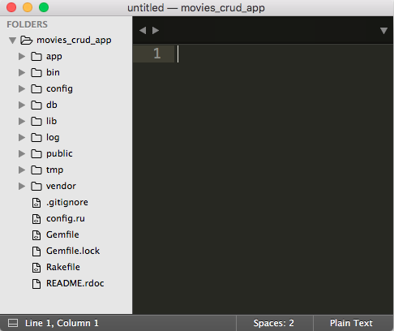
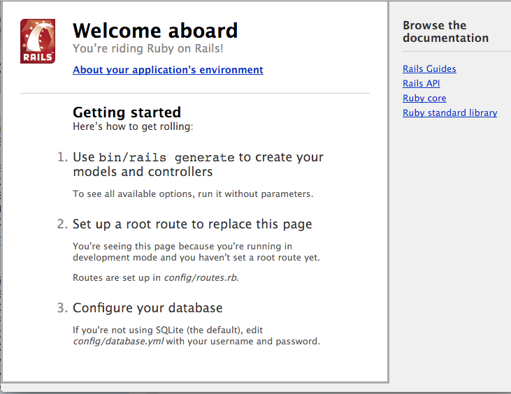

## Objectives
* Draw Diagrams that show the flow of a HTTP Requests and Responses and the how the Model, View and Controller interact.
* Start to create a cheatsheet for all the Rails and Rack commands. 
* Create a Rails backend app.
* Review the file/directory structure for Rails.
* Initialse the DB for this Rails application.
* Start the Rails app and access it.
* Create an ActiveRecord Model.
* Create a DB Migration.
* Migrate the Rails DB.
* Check the DB for the Table associated with the Model.
* Create a Seed file that will populate the DB.
* Populate the DB with this seed data.
* Use some ArticeRecord methods in the Rails console to find movies.

### Model, View, Controller (MVC)

Rails is based on the MVC Architecture.


* A **HTTP Request** is sent from the **Client**, (browser/curl).
* The **URL Path** will determine what **Controller** will be executed.
* The **URL Path** will uniquely indentify a **Resource**, (Song, Movie, Person, ...), this is implemented as **Model**.
* This **Resource** and it's current state is persisted/stored in a **DB** table.
* The **Representation** of this **Resource** is built by the **View**. The **Representation** could be in HTML, JSON, XML, PDF and Image, etc.

We'll talk more about this architecture as we progress. And we'll see how an HTTP Request/Response flows thru and app.


## Create a new Rails application.


###Install Rails.

*Note: this can be done from within any directory*


* Let's see what versions of rails we have installed already. 

```
$ gem list |grep rails
``` 

* Let's install the lastest version of rails.

```
$ gem install rails
```

### Create a Rails application.

Create a Rails app that will use a SQLite DB

```
$ rails new movies_crud_app -T 
```

This will create a Rails application named movies_crud_app.

The -T option, or --skip-test-unit, option will exclude the tests from this Rails app. 

This will: 

* Create a directory named `movies_crud_app` that will contain all the directories, files and code for a baseline Rails application.
* Get all of the Ruby Gems needed by this application as indicated in this application's Gemfile. _These gems will be downloaded from `https:://rubygems.org` if they don't already exist on your local machine._


```ruby  
source 'https://rubygems.org'

# Bundle edge Rails instead: gem 'rails', github: 'rails/rails'                                               
gem 'rails', '4.2.5.1'
	...
	
```

* Install Ruby Gems. This will install the ruby gems on your local system/machine.

```bash
$ bundle install
```

> Note: that it may stall after the `bundle install` command. This is because Rails is loading and installing all the Ruby Gems and their dependencies for app that are listed in the `Gemfile`.

### Review Rail application directory structure.

Change into this `movies_crud_app` directory and take a look at how Rails gives you a very clear location to place all the code you'll be writing.


```
$ cd movies_crud_app
$ subl .

```

All Rails apps are structured in a very specific way. This is called **Convention Over Configuration**. The creator of Rails [David Heinemeier Hansson (DHH) ](http://david.heinemeierhansson.com/) has strong opinions about web and software development. In fact, Rails is often described as a *strongly opioniated*. 

Another words, there are very specific and consistent locations in the directory structure for code that serves a specific purpose. 

All Rails application maintain these consistent locations for code and other artifacts needed for our application.



The **bold** directories are where we'll be writing the vast majority of our application's code.

* __app - Where most code for you application exists.__
* bin - Scripts used by rails. _We won't be working in here._
* __config - Contains configuration and code that will be excecuted when this app is initialized, i.e. startup code and configuration.__
* __db - Contains code needed to setup the DB.__
* lib - General Ruby code that is needed by the app that doesn't fall into the Model/View/Controllers.
* log - Log files. Files generated by a running Rails app that record the operations of the app. _We'll be looking at this a lot._
* public - Mix of front-end files, (HTML, CSS, Images), that mostly generated within your web application.
* tmp - Temp files.
* vendor - Files used for 3rd party libraries that are not gems.


## Rails Environments

By default, Rails can run in three different environments.

### Development Mode

The mode the app is in when developers are writing code and developing the app. 

One great feature of this mode is that we don't have to restart the server after our changes. __Changes are automatically picked up by Rails.__

### Testing Mode

The mode the app is in when it's being tested. When we run our tests this is the mode we are running in.

### Production Mode

The mode the app is in when it's __live__, "In Production", being used online.

__By Default the Rails application will start in Development Mode.__

Take a look at the configuration for each mode.

```bash
$ cd config/environments
$ ls
development.rb  production.rb   test.rb
```

Each file will configure each of the Rails mode. 


For example, the development.rb file will configure the app so that on every HTTP Request the app's code will be reloaded. _This will pick up any changes to your code since the last request!_

```ruby
 # In the development environment your application's code is reloaded on                                     
  # every request. This slows down response time but is perfect for development                               
  # since you don't have to restart the web server when you make code changes.                                
  config.cache_classes = false
```

## Create a database for this rails app. 

**Rails applications always need a DB to store or persist it's data.**


* Create a database.

```
$ rake db:create
```

This will create __TWO__ Databases.  One each for the `development` and `test` environments.

> Note: For sqlite these DBs are just files in the `db` directory, `db/development.sqlite3` and `db/test.sqlite3`

Open up the `config/database.yml` file. This is a YAML file use to configure a DB for each Rails environment.

> NOTE: YAML is "Yet Another Markup Language"

Notice, how each environment's database is named after the environment and app name.

__In the config/database.yml file:__

```
...
database: movies_crud_app_development
...
database: movies_crud_app_test
...
database: movies_crud_app_production
```

## Start the Rails app.
```
$ rails server
```

**Access the default Rails URL.**

In your browser, go to this app running on your local machine, `localhost`, port `3000`.  

`http://localhost:3000`.

Ya, you should see the Welcome Aboard page. Rails is running!!!



## Generate a Movie Migration and Model

A Migration is a Ruby class that will generate SQL [Data Definition Statements](https://en.wikipedia.org/wiki/Data_definition_language) that will update a DB schema. _Typically, adding or modifying a DB table.__

A Model is a Ruby class that is used to persist a specific __Resource__, Movie, in a DB table.

__Use a rails generator to create a Movie model.__

```
$ rails generate model Movie name:string rating:string desc:text length:integer
```

Notice that we generate two files.

* Migration file in `db/migrate/<timestamp>_create_movies.rb`
* Model file in `app/models/movie.rb.` 

## Migrate the DB by creating a DB Table.

__Open up the `db/migrate/<timestamp>_create_movies.rb` file.__

```ruby
class CreateMovies < ActiveRecord::Migration
  def change
    create_table :movies do |t|
      t.string :name
      t.string :rating
      t.text :desc
      t.integer :length

      t.timestamps null: false
    end
  end
end
```

This is the migration file that was generated above. It will create a **Table** in the **DB**. The table will be named `movies` and it will have **Seven** columns.

* name - a column that will be a Ruby String. This is typically a 'varchar' DB column type.
* rating - a column that will be a Ruby String.
* desc - a column that will be a Ruby String. This is typically a 'text' DB column type.
* length - a column that will be Ruby Fixnum. This is typically a 'integer' DB column type.
* id - a column that represents a **PRIMARY KEY (PK)** is a Ruby Fixnum. A __PK__ uniquely identifies a row in the table. This is a 'integer' DB column type and **MUST** exists.
* created_at - a column that will be a Ruby DateTime object. This is  a 'datetime' DB column type.
* updated_at - a column that will be a Ruby DateTime object. This is  a 'datetime' DB column type.

> Note: the `created_at` and `updated_at` columns are created by the t.timestamps in the migration. And the id column is automatically generated for every table.

[Rails Guide - Active Record Migrations](http://guides.rubyonrails.org/active_record_migrations.html)

#### Apply this Migration.

This will use the above migration to generate the SQL to CREATE a table with the above columns and apply it to the `development` DB.

```
rake db:migrate
```

This will run the migrations to create a *movies* table that has a name, rating, desc and length columns. 

*Check the DB to confirm the existence of the movies table and the above columns*

```
rails dbconsole
```

This will bring up **psql**. *Command line utility to view the DB.*

Lets look at all the tables in the DB. And describe the movies table. 

```
sqlite>
sqlite> .schema movies
CREATE TABLE "movies" ("id" INTEGER PRIMARY KEY AUTOINCREMENT NOT NULL, "name" varchar, "rating" varchar, "de\
sc" text, "length" integer, "created_at" datetime NOT NULL, "updated_at" datetime NOT NULL); 
sqlite> 
sqlite> 
```

We can see that the **DB Schema** shows we have a movies table with the correct table.

> Note: Control-D to exit the dbconsole.

### View the current DB Schema

**Open the db/schema.rb file.**

```ruby
ActiveRecord::Schema.define(version: 20160311041224) do

  create_table "movies", force: :cascade do |t|
    t.string   "name"
    t.string   "rating"
    t.text     "desc"
    t.integer  "length"
    t.datetime "created_at", null: false
    t.datetime "updated_at", null: false
  end

end
```

This file will always reflect the current schema for the DB!

## Movie Model

The other file generated above is in `app/models/movie.rb`.

```ruby
class Movie < ActiveRecord::Base
end
```

A Model is a Plain Old Ruby Class that inherits it's behavior from the ActiveRecord Ruby Class.

Active Record allows one to __C__reate, __R__ead, __U__pdate and __D__elete rows in the `movies` table.


## Create seed data

At this point we have a `movies` table BUT it has not data in it. There are NO rows for any movies.

Let's populate the `movies` table in the DB.

**Add the below to db/seeds.rb**

```
# Delete All Existing Movies
Movie.delete_all

# Create three movies
Movie.create!(name: 'Affliction', rating: 'R', desc: 'Little Dark', length: 123)
Movie.create!(name: 'Mad Max', rating: 'R', desc: 'Fun, action', length: 154)
Movie.create!(name: 'Rushmore', rating: 'PG-13', desc: 'Quirky humor', length: 105)

puts "Created three Movies"
```

[ActiveRecord Rails Guide - CRUD: Reading and Writing Data](http://guides.rubyonrails.org/active_record_basics.html#crud-reading-and-writing-data)

**Add this data to the `movies` table.**

```
rake db:seed
```

This rake command will run the code in the db/seeds.rb file which will create three Movies in the DB using ActiveRecord.

> NOTE: the ActiveRecord#create! method will create a row in the `movies` table.

> In this case the `create!` method will take one argument, a Hash of key/values pairs where the key is the column and the value is the data for this row. 

**Check the DB with the dbconsole**

```
$ rails dbconsole

sqlite> SELECT * FROM movies;                                                   
SELECT * FROM movies;                                                           
1|Affliction|R|Little Dark|123|2016-03-11 04:44:47.297887|2016-03-11 04:44:47.2\
97887                                                                           
2|Mad Max|R|Fun, action|154|2016-03-11 04:44:47.306818|2016-03-11 04:44:47.3068\
18                                                                              
3|Rushmore|PG-13|Quirky humor|105|2016-03-11 04:44:47.309937|2016-03-11 04:44:4\
7.309937                                                                        
sqlite> 
```

Yes, we have three movies in the `movies` table.


**Check with rails console**

The Rails console will allow us to use the Rails models to view the models. _It provides a view into the Rails application code_.

```
$ rails console
```

The rails console is *VERY* important for debugging and checking rails.  


Run the below commands in the Rails console.  *Notice the SQL that is created by each of the below ActiveRecord methods. 

**Read Movies using the `Movie` model.**

```ruby
> m1 = Movie.first

> m1.name
"Affliction"
> m1.rating
"R"
> m1.length
123
>
> mlast = Movie.last
...
> mlast.name
"Rushmore"
>
> m2 = Movie.find(2)
> m2.name
"Mad Max"
>
> Movie.all
...
> Movie.find_by_name("Mad Max")
...
> Movie.find_by_rating("R")
...
> Movie.where(rating: "R")
...
```
What's going on here?

We are using Active Record methods to find models in the DB. 

* Movie.first - First row in the `movies` table.
* Movie.last - Last row in the `movies` table.
* Movie.find(2) - Row with a id = 2 in the `movies1` table.
* Movie.all - All rows in the `movies` table.
* Movie.find_by_name("Mad Max") - Find the _first_ movie in the table with a name of "Mad Max"
* Movie.where(rating: "R") - Find _all_ movies with a rating of "R"

**ActiveRecord allow us to use Ruby models to Create, Read, Update and Delete data in the DB**.


[ActiveRecord Rails Guide - Active Record Basics](http://guides.rubyonrails.org/active_record_basics.html)

## Cheatsheet

* Create a new rails app.

```
$ rails new movies_crud_app -T 
```

* Create the DB for this app.

```
$ cd movies_crud_app
$ rake db:create
```

* Run the rails app on localhost port 3000.

```
$ rails server
```

_Should see the Welcome Page at `http://localhost:3000`_

* Create a movie migration and model.

```
$ rails generate model Movie name:string rating:string desc:text length:integer
```

* Create a `movies` table in the DB, i.e. run the migration.

```
$ rake db:migrate
```

* Create seed data in the movies table. _Add code above to the `db/seed.rb` file._

```
$ rake db:seed
```

* Check the current DB schema in `db/schema.rb`.
* Check the data in the movies table.

```
$ rails dbconsole
> SELECT * FROM movies;
...
> 
```

* Use the Rails console to find data using the Movie ActiveRecord class/model.

```
$ rails console
> m1 = Movie.first
> m2 = Movie.find(2)
> mlast = Movie.last
> all_movies = Movie.all
> all_movies[2]
> Movie.find_by_name("Mad Max")
> Movie.find_by_rating("R")
> Movie.where(rating: "R")
```

## Lab

* Create a Song resource in **this application**. Each Song will have a title, artist, description, price and length. 

* The title and artist are simple strings, desc is a 'text' field because it could have a lot of text. What should the price and length types be? 

* Look up the rails guide for migrations and find out.

* Create a couple of songs in the db/seeds.rb file. 

* Don't forget to use the rails dbconsole and rails console commands to verify you've created 3 songs.


## Add another attribute/column to Movie/movies model and table.

We just had a request to capture the released year for each of our movies. Let's implement this.

**Generate a migration that add a released_year attribute to the Movie model.**

```
$ rails generate migration AddReleasedYearToMovie released_year:integer
...
```

Will generate a migration to add the released_year column to the movies table.

**Open `db/migrate/<timestamp>_add_released_year_to_movie.rb`**

```ruby
class AddReleasedYearToMovie < ActiveRecord::Migration
  def change
    add_column :movies, :released_year, :integer
  end
end
```

**Apply this migration to the movies table.**

```
$ rake db:migrate
```

**Check the db/schema.rb has been updated.**

```ruby
ActiveRecord::Schema.define(version: 20160311052554) do

  create_table "movies", force: :cascade do |t|
    t.string   "name"
    t.string   "rating"
    t.text     "desc"
    t.integer  "length"
    t.datetime "created_at",    null: false
    t.datetime "updated_at",    null: false
    t.integer  "released_year"
  end

end
```

**Update the seed data with the release year.**

```ruby
...
Movie.create!(name: 'Affliction', rating: 'R', desc: 'Little Dark', length: 123, released_year: 1997)
Movie.create!(name: 'Mad Max', rating: 'R', desc: 'Fun, action', length: 154, released_year: 2015)
Movie.create!(name: 'Rushmore', rating: 'PG-13', desc: 'Quirky humor', length: 105, released_year: 1998)
...
```
**Update the movies table**

```
$ rake db:migrate
```

**Check with the Rails console**

```
$ rails console
> Movie.first.released_year
> Movie.second.released_year
> Movie.last.released_year
>
> Movie.all.map(&:released_year)
> 
```

* Movie.all.map(&:released_year) - For each movie in the DB call the released_year method. This will return an Array of all the released years. _Uses Ruby's symbol to proc syntax._

## Lab

* Add a released year attribute to the Song model.

## Drop, Create, Migrate and Seed the DB.

This is often useful if you have messed up a migration or somehow introduced bad DB schema or data.

```
$ rake db:drop
$ rake db:create
$ rake db:migrate
$ rake db:seed
```

**Check the Movies using the Rails console!!*

## Add the `annotate` gem to your app.

The [annotate gem](https://github.com/ctran/annotate_models) to your application. 

This will add a comment summarizing the current schema to the top of your ActiveRecord models.

**Update the Gemfile**

```ruby
...
group :development, :test do
  gem 'annotate'
  ...
end
...
```

This will add the annote gem when this Rails application is running in the Rails development or test environments.

**Install the gem on your local machine from rubygems.org.**

```
$ bundle install
```

**Annotate your ActiveRecord Models. Your Movie and Song models.**

```
$ bundle exec annotate
```

**View the Annotations in the Movie ActiveRecord model, `app/models/movie.rb`.**

```ruby
# == Schema Information                                                         
#                                                                               
# Table name: movies                                                            
#                                                                               
#  id            :integer          not null, primary key                        
#  name          :string                                                        
#  rating        :string                                                        
#  desc          :text                                                          
#  length        :integer                                                       
#  created_at    :datetime         not null                                     
#  updated_at    :datetime         not null                                     
#  released_year :integer                                                       
#                                                                               

class Movie < ActiveRecord::Base
end
```

> See how this annotate command will generate comments that show the current state of your Model's attributes.

#### This final app, `movie_crud_app`, is kept []()


